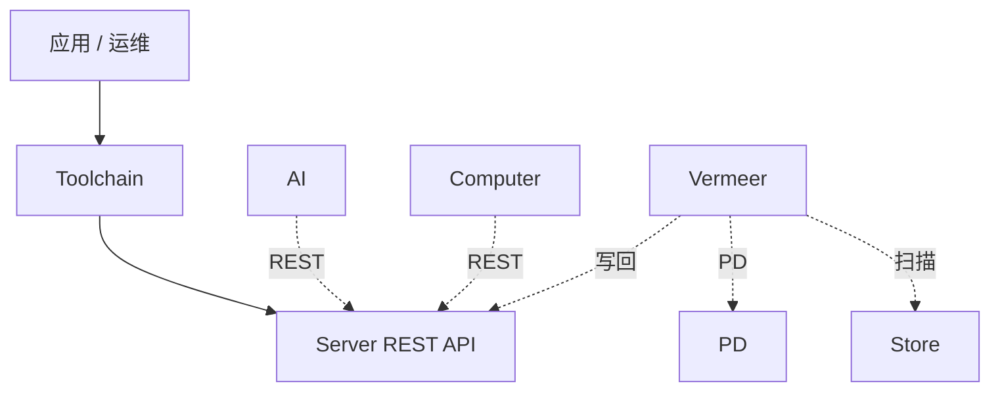
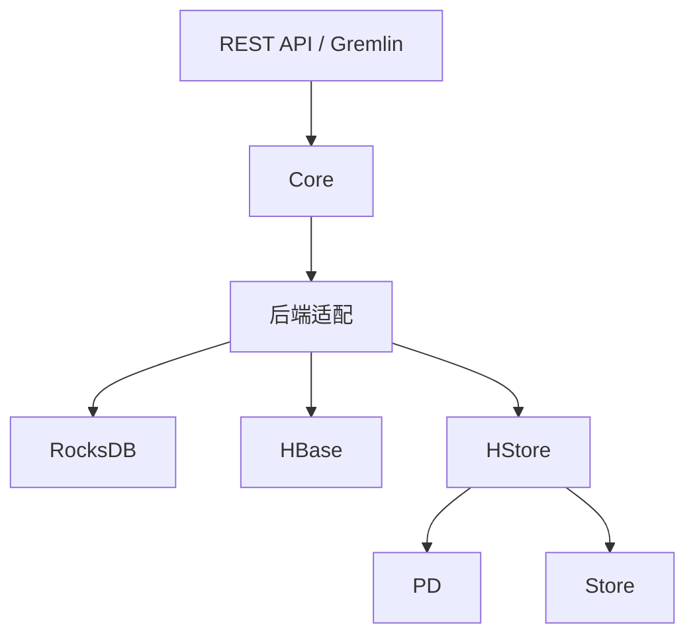

## 全栈组件

HugeGraph 生态由职责不同的图数据库、图计算、图 AI 和工具链组件组成。HugeGraph Server 提供 OLTP 图数据库服务；HugeGraph-Computer 与 Vermeer 是独立的 OLAP 图计算引擎；HugeGraph-AI 提供图 AI 能力。Toolchain 中的客户端、数据导入、可视化和运维工具为应用及运维人员提供配套入口。

## 生态接入

虚线表示可选的 HugeGraph 接入，不代表所有 AI、Computer 或 Vermeer 任务都必须连接 Server、PD 或 Store。Computer 和 AI 通过 Server REST API 读写图数据。Vermeer 的 HugeGraph 输入模式向 PD 查询分区元数据，并直接向 Store 扫描 HStore 分区；选择 HugeGraph 结果输出时，再通过 Server REST API 写回结果。

## Server 内部结构

Server 的 REST API 和 Gremlin 接口把请求交给 Core，再由存储后端适配器执行读写。RocksDB 和 HBase 是独立后端；HStore 适配器从 PD 获取集群元数据和分区信息，并向 Store 节点发送图数据操作。PD 管理集群元数据与分区，不承载图数据读写路径。

截至 HugeGraph 1.7.0，Server 提供 RocksDB、HBase、HStore 和内存后端实现。内存后端主要用于测试或临时使用，不属于正式持久化部署选项；生产部署方式见 [Server 快速开始](/cn/docs/quickstart/hugegraph/hugegraph-server/)。

Toolchain 的主要组件如下：

- [Hubble](/cn/docs/quickstart/toolchain/hugegraph-hubble/)：通过 Web 界面连接图数据库，管理 Schema、导入数据并执行查询。
- [Loader](/cn/docs/quickstart/toolchain/hugegraph-loader/)：转换多种数据源并批量导入图数据。
- [Tools](/cn/docs/quickstart/toolchain/hugegraph-tools/)：提供部署、管理和备份恢复命令。
- [Client](/cn/docs/quickstart/client/hugegraph-client/)：封装 Server 连接、Schema 管理、图数据读写和查询；支持 [Java](/cn/docs/quickstart/client/hugegraph-client/)、[Python](/cn/docs/quickstart/client/hugegraph-client-python/) 和 [Go](/cn/docs/quickstart/client/hugegraph-client-go/) 客户端，Rust 客户端仍在开发中。

## 独立图计算引擎

- [Vermeer（默认入口）](/cn/docs/quickstart/computing/hugegraph-vermeer/)：提供独立的图计算服务及算法接口。
- [HugeGraph-Computer](/cn/docs/quickstart/computing/hugegraph-computer/)：基于 BSP/Pregel 模型的 Java 分布式图计算引擎。

## 历史架构图

下图保留作历史参考，其中 Server 同时承担 OLTP 与 OLAP、以及多种旧后端的标注不代表 HugeGraph 1.7.0 的当前实现。

> [!DETAILS]- 展开旧版架构图
>
> 
