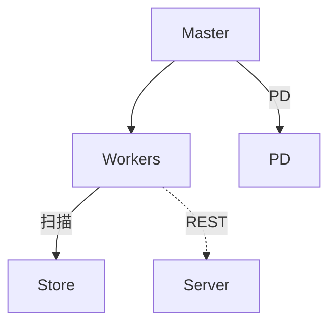
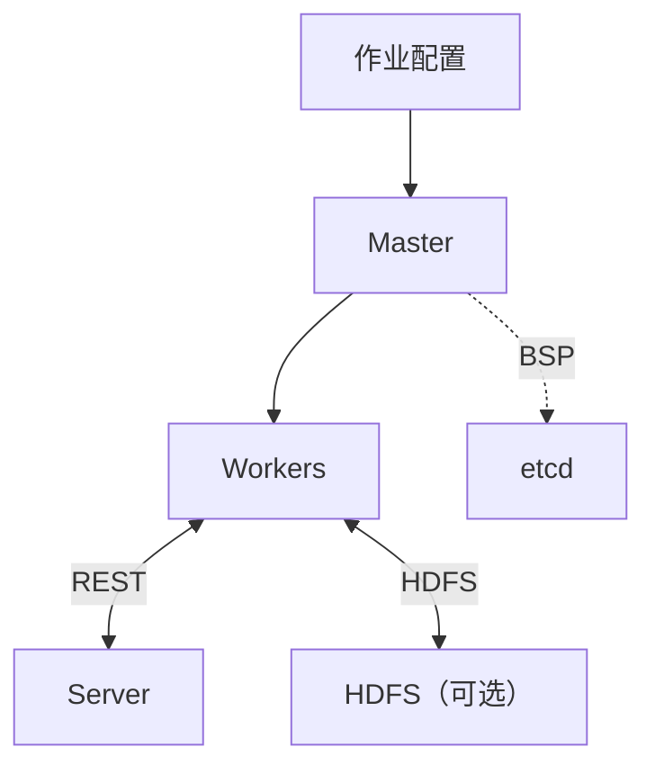

HugeGraph-Computer 仓库包含两套部署和运行方式不同的图计算系统。通用图算法任务默认建议从 Go Vermeer 开始；需要 Java BSP/Pregel 分布式计算模型时，请使用 Computer。两者都可接入 HugeGraph，但配置和作业入口不能互换。

### 默认入口：Go Vermeer

当 `load.type=hugegraph` 时，Vermeer Master 通过 PD 查询分区元数据，Workers 直接扫描 HStore Store 分区。仅当 `output.type=hugegraph` 时，Workers 才通过 Server REST API 写回结果；其他数据源或输出配置不需要对应连接。

### Java Computer

作业配置可由 Kubernetes Operator 或 YARN 提交。Workers 通过 REST API 从 HugeGraph Server 读取图数据，并可按输出配置写回计算结果；选择 HDFS 输入或输出时，Workers 直接访问 HDFS。Master 使用 etcd 协调 BSP 作业。

- [Vermeer 快速入门（默认入口）](./hugegraph-vermeer.md)
- [Computer 快速开始](./hugegraph-computer/)
- [Computer 配置参考](./hugegraph-computer-config.md)
- [Computer 源码](https://github.com/apache/hugegraph-computer)
