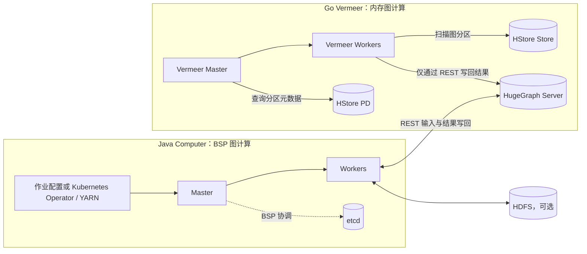

HugeGraph-Computer 仓库包含两套部署和运行方式不同的图计算系统。Java Computer 使用 BSP 模型执行分布式作业；Go Vermeer 使用 master-worker 结构运行内存图计算。它们可使用 HugeGraph 作为图数据源，但配置和作业入口不能互换。

Vermeer Master 通过 PD 获取分区元数据，Vermeer Workers 直接扫描 Store；选择 HugeGraph 结果输出时，Workers 才通过 Server REST API 写回结果。Java Computer 的 Workers 则通过 HugeGraph REST API 读取图数据并写回计算结果。

- [Computer 快速开始](./hugegraph-computer/)
- [Computer 配置参考](./hugegraph-computer-config.md)
- [Vermeer 快速入门](./hugegraph-vermeer.md)
- [Computer 源码](https://github.com/apache/hugegraph-computer)
