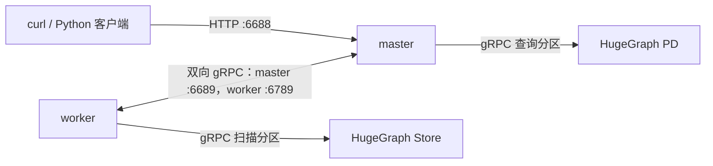

## 一、Vermeer 概述

### 1.1 运行架构

Vermeer 是使用 Go 编写、以内存为主的图计算框架，支持 15+ OLAP 图算法。当前由一个 master 调度，可连接多个 worker。

master 是负责通信、转发、汇总的节点，计算量和占用资源量较少。worker 是计算节点，用于存储图数据和运行计算任务，占用大量内存和 cpu。grpc 和 rest 模块分别负责内部通信和外部调用。

启动时，程序先设置内置默认值，再读取工作目录下 `config/<env>.ini` 的 `[default]` 节，最后由显式命令行参数覆盖对应配置；例如 `--env=master` 读取 `config/master.ini`。Docker 镜像把仓库中的配置复制到 `/go/bin/config/`，并以 `/go/bin/` 为工作目录。挂载宿主机目录到 `/go/bin/config` 会遮住镜像自带文件，因此该目录必须包含实际使用的 ini 文件。配置读取器不从环境变量取值。

默认端口如下：

| 角色 | 配置键 | 默认地址 | 用途 |
|---|---|---|---|
| master | `http_peer` | `0.0.0.0:6688` | REST API；宿主机客户端访问此端口 |
| master | `grpc_peer` | `0.0.0.0:6689` | worker 连接 master 的 gRPC 端口 |
| worker | `http_peer` | `0.0.0.0:6788` | worker HTTP 服务 |
| worker | `grpc_peer` | `0.0.0.0:6789` | worker gRPC 监听地址，同时会通告给 master 供节点间通信 |

Docker 示例只把 master 的 HTTP 端口发布为 `6688:6688`；master 和 worker 的 gRPC 端口留在容器网络内部。



### 1.2 运行方法

下面两种 Docker 启动方式都需要先准备一个宿主机配置目录。请在 Vermeer 仓库根目录执行，将项目提供的 [`master.ini`](https://github.com/apache/hugegraph-computer/blob/04985bbc9907c7b6c9a8fe8833323df049f9bd9b/vermeer/config/master.ini) 和 [`worker.ini`](https://github.com/apache/hugegraph-computer/blob/04985bbc9907c7b6c9a8fe8833323df049f9bd9b/vermeer/config/worker.ini) 模板复制到该目录；挂载会覆盖镜像里的 `/go/bin/config`，所以不要把空目录或整个用户主目录挂进去：

```shell
CONFIG_DIR="$HOME/vermeer-config"
mkdir -p "$CONFIG_DIR"
cp config/master.ini config/worker.ini "$CONFIG_DIR/"
```

`master.ini` 保留 HTTP/gRPC 监听地址 `0.0.0.0:6688` 和 `0.0.0.0:6689`。Compose 示例为网络分配固定地址 `172.20.0.10`（master）和 `172.20.0.11`（worker），因此将复制后的 `worker.ini` 中这些配置设为：

```ini
[default]
http_peer=0.0.0.0:6788
grpc_peer=172.20.0.11:6789
master_peer=172.20.0.10:6689
run_mode=worker
worker_group=$
```

此单 worker 示例将 `worker_group` 设为 `$`，表示未绑定命名组时使用的通用组；请在 ini 文件中原样写入美元符号。仓库模板默认是 `worker_group=default`，若保留命名组，需先将它绑定到任务所在的空间或图，再提交任务。例如默认空间为 `$DEFAULT` 时，可执行：

```shell
curl --fail --show-error -X POST \
  'http://localhost:6688/admin/workers/alloc/default/%24DEFAULT'
```

该接口响应 `errcode=0` 表示绑定成功；启用 token 鉴权时还需带上授权请求头。`master_peer` 必须指向 worker 所在网络能访问的 master gRPC 地址。`grpc_peer` 同时用于 worker 监听和向 master 通告自己的地址，不能设为不可从其他容器访问的 `0.0.0.0`。如果更改网络子网或地址，需同步修改此处的 IP；多个 worker 还需要各自唯一且可互相访问的 `grpc_peer` 地址。

1. **方案一：Docker Compose（推荐）**

在 Vermeer 仓库根目录运行。可以修改仓库已有的 `docker-compose.yaml`，也可以使用下面的配置。仓库文件当前将整个 `~/` 挂载到配置目录且没有发布 master HTTP 端口，运行前必须按示例更换挂载路径并增加端口映射：

```yaml
services:
  vermeer-master:
    image: hugegraph/vermeer
    container_name: vermeer-master
    ports:
      - "6688:6688"
    volumes:
      - /home/user/vermeer-config:/go/bin/config:ro
    command: --env=master
    networks:
      vermeer_network:
        ipv4_address: 172.20.0.10 # master 固定地址

  vermeer-worker:
    image: hugegraph/vermeer
    container_name: vermeer-worker
    volumes:
      - /home/user/vermeer-config:/go/bin/config:ro
    command: --env=worker
    networks:
      vermeer_network:
        ipv4_address: 172.20.0.11 # worker 固定地址

networks:
  vermeer_network:
    driver: bridge
    ipam:
      config:
        - subnet: 172.20.0.0/24 # 按需更换子网
```

把 `/home/user/vermeer-config` 换成上面实际的配置目录绝对路径。若修改 `vermeer_network` 的子网或固定 IP，也要同步更新 `worker.ini` 中的 `grpc_peer` 和 `master_peer`。不要复用默认 `worker.ini` 的 `grpc_peer=0.0.0.0:6789` 作为容器间通告地址。

在项目目录构建镜像并启动：

```shell
# 构建镜像（在项目根 vermeer 目录）
docker build -t hugegraph/vermeer .

# 启动（在 vermeer 根目录）
docker-compose up -d
# 或使用新版 CLI：
# docker compose up -d
```

查看日志 / 停止 / 删除：

```shell
docker-compose logs -f
docker-compose down
```

2. **方案二：通过 docker run 单独启动（手动创建网络并分配静态 IP）**

将 `CONFIG_DIR` 设为上面准备的配置目录，并确保复制后的 `worker.ini` 已按固定容器地址设置 `grpc_peer` 和 `master_peer`。该示例中的 `CONFIG_DIR` 需替换为实际的绝对路径。

构建镜像：

```shell
docker build -t hugegraph/vermeer .
```

创建自定义 bridge 网络（一次性操作）：

```shell
docker network create --driver bridge \
  --subnet 172.20.0.0/24 \
  vermeer_network
```

运行 master（调整 CONFIG_DIR 为您的绝对配置路径，可以根据实际情况调整IP）：

```shell
CONFIG_DIR=/home/user/vermeer-config

docker run -d \
  --name vermeer-master \
  --network vermeer_network --ip 172.20.0.10 \
  -p 6688:6688 \
  -v ${CONFIG_DIR}:/go/bin/config:ro \
  hugegraph/vermeer \
  --env=master
```

运行 worker：

```shell
docker run -d \
  --name vermeer-worker \
  --network vermeer_network --ip 172.20.0.11 \
  -v ${CONFIG_DIR}:/go/bin/config:ro \
  hugegraph/vermeer \
  --env=worker
```

查看日志 / 停止 / 删除：

```shell
docker logs -f vermeer-master
docker logs -f vermeer-worker

docker stop vermeer-master vermeer-worker
docker rm vermeer-master vermeer-worker

# 删除自定义网络（如果需要）
docker network rm vermeer_network
```

3. **方案三：从源码构建**

构建。具体请参照 [Vermeer Readme](https://github.com/apache/hugegraph-computer/tree/master/vermeer)。

```shell
go build
```

从 Vermeer 仓库根目录启动，例如 `./vermeer --env=master` 和 `./vermeer --env=worker01`。`worker01.ini` 中的 `grpc_peer` 应填写可由 master 和其他 worker 访问、且本机可以绑定的地址；`master_peer` 指向 master 的 gRPC 监听地址。

启动 master 后，在宿主机验证 HTTP 端口：

```shell
curl --fail --show-error http://localhost:6688/graphs
```

请求应返回 HTTP 200，JSON 响应中的 `errcode` 为 `0`。

## 二、任务创建类 rest api

### 2.1 简介

创建任务的流程是先提交 `load` 任务，等待图加载完成，再提交 `compute` 任务。同一张已加载的图可重复用于计算，不会因任务完成而自动删除。异步接口返回创建结果和任务信息（包括任务 ID），不代表任务已经完成；同步接口会一直等待任务进入成功或失败状态，调用方及代理的 HTTP 超时需足够长。任务状态可通过查询接口读取：加载成功为 `loaded`，计算成功为 `complete`，失败为 `error`，取消为 `canceled`，其余状态仍在等待或执行中。图在加载中或错误状态时不能用于计算；删除图要求图处于可删除状态且当前未被使用。

可以使用的 url 如下：

- 异步接口：`POST http://master_ip:port/tasks/create`，从响应的 `task.id` 取得任务 ID。
- 同步接口：`POST http://master_ip:port/tasks/create/sync`，等待该任务结束后返回。
- 查询单个任务：`GET http://master_ip:port/task/{task_id}`；响应中的 `errcode` 为 `0` 表示查询成功，再按 `task.state` 判断业务状态。异步任务应在客户端设置轮询截止时间；到时只停止客户端等待，不会自动取消服务端任务。

### 2.2 加载图数据

以下示例列出常用的加载参数；引擎会按具体加载器读取参数，未被加载器使用的键不会改变行为。

vermeer提供三种加载方式：

1. 从本地加载

`load.vertex_files` 和 `load.edge_files` 是“worker 地址主机部分到文件路径”的映射；路径由对应 worker 进程读取。容器部署时，数据文件必须先挂载进 worker 容器，并填写容器内路径。在上面的 Compose 示例中，应将主机数据目录挂到 worker 的 `/data`（例如增加 `- /host/data:/data:ro`），并把映射键设为 `grpc_peer` 中的 `172.20.0.11`；其他部署则使用各自 worker 上报地址的主机部分。

可以预先获取数据集，例如 twitter-2010 数据集。获取方式：https://snap.stanford.edu/data/twitter-2010.html，第一个 twitter-2010.txt.gz 即可。

**request 示例：**

```javascript
POST http://localhost:6688/tasks/create
{
 "task_type": "load",
 "graph": "testdb",
 "params": {
  "load.parallel": "50",
  "load.type": "local",
  "load.vertex_files": "{\"172.20.0.11\":\"/data/twitter-2010.v_[0,99]\"}",
  "load.edge_files": "{\"172.20.0.11\":\"/data/twitter-2010.e_[0,99]\"}",
  "load.use_out_degree": "1",
  "load.use_outedge": "1"
 }
}
```

2. 从hugegraph加载

**request 示例：**

⚠️ 安全警告：切勿在配置文件或代码中存储真实密码。请改用环境变量或安全的凭据管理系统。

```javascript
POST http://localhost:6688/tasks/create
{
  "task_type": "load",
  "graph": "testdb",
  "params": {
    "load.parallel": "50",
    "load.type": "hugegraph",
    "load.hg_pd_peers": "[\"<pd-address-reachable-from-vermeer>:8686\"]",
    "load.hugegraph_name": "DEFAULT/hugegraph2/g",
    "load.hugegraph_username": "admin",
    "load.hugegraph_password": "<your-password-here>",
    "load.use_out_degree": "1",
    "load.use_outedge": "1"
  }
}
```

Vermeer master 使用 `load.hg_pd_peers` 连接 PD 并查询分区，worker 再连接 PD 返回的 Store 地址读取数据。因此这些服务地址必须能从对应的 Vermeer 容器或主机访问；在 Docker 容器里，`127.0.0.1` 指向容器自身，不能用来代替宿主机或另一容器的地址。

3. 从hdfs加载

**request 示例：**

```javascript
POST http://localhost:6688/tasks/create
{
  "task_type": "load",
  "graph": "testdb",
  "params": {
    "load.parallel": "50",
    "load.type": "hdfs",
    "load.hdfs_namenode": "name_node1:9000",
    "load.hdfs_conf_path": "/path/to/conf",
    "load.krb_realm": "EXAMPLE.COM",
    "load.krb_name": "user@EXAMPLE.COM",
    "load.krb_keytab_path": "/path/to/keytab",
    "load.krb_conf_path": "/path/to/krb5.conf",
    "load.hdfs_use_krb": "1",
    "load.vertex_files": "/data/graph/vertices",
    "load.edge_files": "/data/graph/edges",
    "load.use_out_degree": "1",
    "load.use_outedge": "1"
  }
}
```

### 2.3 输出计算结果

当前有实际写入器的结果方式为 `local`、`hdfs` 和 `hugegraph`，通过 `output.type` 指定；`none` 表示不写出结果。源码保留 `afs` 类型常量，但当前主线没有注册 AFS 加载器或写入器。指定 `output.need_statistics` 为 `1` 时，统计结果会写入任务信息；统计算子的适用范围取决于对应算法实现。

以下示例列出常用的计算和结果输出参数；算法支持的参数以 Vermeer 当前实现为准。

request 示例：

```javascript
POST http://localhost:6688/tasks/create
{
 "task_type": "compute",
 "graph": "testdb",
 "params": {
 "compute.algorithm": "pagerank",
 "compute.parallel": "10",
 "compute.max_step": "10",
 "output.type": "local",
 "output.parallel": "1",
 "output.file_path": "result/pagerank"
  }
}
```

`output.type=local` 的结果写在执行任务的 worker 本地文件系统中；容器部署时，如需从宿主机读取结果，请将 worker 的输出目录挂载出来。

## 三、支持的算法

### 3.1 PageRank

PageRank 算法又称网页排名算法，是一种由搜索引擎根据网页（节点）之间相互的超链接进行计算的技

术，用来体现网页（节点）的相关性和重要性。

- 如果一个网页被很多其他网页链接到，说明这个网页比较重要，也就是其 PageRank 值会相对较高。
- 如果一个 PageRank 值很高的网页链接到其他网页，那么被链接到的网页的 PageRank 值会相应地提高。

PageRank 算法适用于网页排序、社交网络重点人物发掘等场景。

request 示例：

```javascript
POST http://localhost:6688/tasks/create
{
 "task_type": "compute",
 "graph": "testdb",
 "params": {
 "compute.algorithm": "pagerank",
 "compute.parallel":"10",
 "output.type":"local",
 "output.parallel":"1",
 "output.file_path":"result/pagerank",
 "compute.max_step":"10"
 }
}
```

### 3.2 WCC（弱连通分量）

弱连通分量，计算无向图中所有联通的子图，输出各顶点所属的弱联通子图 id，表明各个点之间的连通性，区分不同的连通社区。

request 示例：

```javascript
POST http://localhost:6688/tasks/create
{
 "task_type": "compute",
 "graph": "testdb",
 "params": {
 "compute.algorithm": "wcc",
 "compute.parallel":"10",
 "output.type":"local",
 "output.parallel":"1",
 "output.file_path":"result/wcc",
 "compute.max_step":"10"
 }
}
```

### 3.3 LPA（标签传播）

标签传递算法，是一种图聚类算法，常用在社交网络中，用于发现潜在的社区。

request 示例：

```javascript
POST http://localhost:6688/tasks/create
{
 "task_type": "compute",
 "graph": "testdb",
 "params": {
 "compute.algorithm": "lpa",
 "compute.parallel":"10",
 "output.type":"local",
 "output.parallel":"1",
 "output.file_path":"result/lpa",
 "compute.max_step":"10"
 }
}
```

### 3.4 Degree Centrality（度中心性）

度中心性算法，算法用于计算图中每个节点的度中心性值，支持无向图和有向图。度中心性是衡量节点重要性的重要指标，节点与其它节点的边越多，则节点的度中心性值越大，节点在图中的重要性也就越高。在无向图中，度中心性的计算是基于边信息统计节点出现次数，得出节点的度中心性的值，在有向图中则基于边的方向进行筛选，基于输入边或输出边信息统计节点出现次数，得到节点的入度值或出度值。它表明各个点的重要性，一般越重要的点度数越高。

request 示例：

```javascript
POST http://localhost:6688/tasks/create
{
 "task_type": "compute",
 "graph": "testdb",
 "params": {
 "compute.algorithm": "degree",
 "compute.parallel":"10",
 "output.type":"local",
 "output.parallel":"1",
 "output.file_path":"result/degree",
 "degree.direction":"both"
 }
}
```

### 3.5 Closeness Centrality（紧密中心性）

紧密中心性（Closeness Centrality）用于计算一个节点到所有其他可达节点的最短距离的倒数，进行累积后归一化的值。紧密中心度可以用来衡量信息从该节点传输到其他节点的时间长短。节点的“Closeness Centrality”越大，其在所在图中的位置越靠近中心，适用于社交网络中关键节点发掘等场景。

request 示例：

```javascript
POST http://localhost:6688/tasks/create
{
 "task_type": "compute",
 "graph": "testdb",
 "params": {
 "compute.algorithm": "closeness_centrality",
 "compute.parallel":"10",
 "output.type":"local",
 "output.parallel":"1",
 "output.file_path":"result/closeness_centrality",
 "closeness_centrality.sample_rate":"0.01"
 }
}
```

### 3.6 Betweenness Centrality（中介中心性算法）

中介中心性算法（Betweeness Centrality）判断一个节点具有"桥梁"节点的值，值越大说明它作为图中两点间必经路径的可能性越大，典型的例子包括社交网络中的共同关注的人。适用于衡量社群围绕某个节点的聚集程度。

request 示例：

```javascript
POST http://localhost:6688/tasks/create
{
 "task_type": "compute",
 "graph": "testdb",
 "params": {
 "compute.algorithm": "betweenness_centrality",
 "compute.parallel":"10",
 "output.type":"local",
 "output.parallel":"1",
 "output.file_path":"result/betweenness_centrality",
 "betweenness_centrality.sample_rate":"0.01"
 }
}
```

### 3.7 Triangle Count（三角形计数）

三角形计数算法，用于计算通过每个顶点的三角形个数，适用于计算用户之间的关系，关联性是不是成三角形。三角形越多，代表图中节点关联程度越高，组织关系越严密。社交网络中的三角形表示存在有凝聚力的社区，识别三角形有助于理解网络中个人或群体的聚类和相互联系。在金融网络或交易网络中，三角形的存在可能表示存在可疑或欺诈活动，三角形计数可以帮助识别可能需要进一步调查的交易模式。

输出的结果为 每个顶点对应一个 Triangle Count，即为每个顶点所在三角形的个数。

注：该算法为无向图算法，忽略边的方向。

request 示例：

```javascript
POST http://localhost:6688/tasks/create
{
 "task_type": "compute",
 "graph": "testdb",
 "params": {
 "compute.algorithm": "triangle_count",
 "compute.parallel":"10",
 "output.type":"local",
 "output.parallel":"1",
 "output.file_path":"result/triangle_count"
 }
}
```

### 3.8 K-Core

K-Core 算法，标记所有度数为 K 的顶点，适用于图的剪枝，查找图的核心部分。

request 示例：

```javascript
POST http://localhost:6688/tasks/create
{
 "task_type": "compute",
 "graph": "testdb",
 "params": {
 "compute.algorithm": "kcore",
 "compute.parallel":"10",
 "output.type":"local",
 "output.parallel":"1",
 "output.file_path":"result/kcore",
 "kcore.degree_k":"5"
 }
}
```

### 3.9 SSSP（单元最短路径）

单源最短路径算法，求一个点到其他所有点的最短距离。

request 示例：

```javascript
POST http://localhost:6688/tasks/create
{
 "task_type": "compute",
 "graph": "testdb",
 "params": {
 "compute.algorithm": "sssp",
 "compute.parallel":"10",
 "output.type":"local",
 "output.parallel":"1",
 "output.file_path":"result/degree",
 "sssp.source":"tom"
 }
}
```

### 3.10 KOUT

以一个点为起点，获取这个点的 k 层的节点。

request 示例：

```javascript
POST http://localhost:6688/tasks/create
{
 "task_type": "compute",
 "graph": "testdb",
 "params": {
 "compute.algorithm": "kout",
 "compute.parallel":"10",
 "output.type":"local",
 "output.parallel":"1",
 "output.file_path":"result/kout",
 "kout.source":"tom",
 "compute.max_step":"6"
 }
}
```

### 3.11 Louvain

Louvain 算法是一种基于模块度的社区发现算法。其基本思想是网络中节点尝试遍历所有邻居的社区标签，并选择最大化模块度增量的社区标签。在最大化模块度之后，每个社区看成一个新的节点，重复直到模块度不再增大。

Vermeer 上实现的分布式 Louvain 算法受节点顺序、并行计算等因素影响，并且由于 Louvain 算法由于其遍历顺序的随机导致社区压缩也具有一定的随机性，导致重复多次执行可能存在不同的结果。但整体趋势不会有大的变化。

request 示例：

```javascript
POST http://localhost:6688/tasks/create
{
 "task_type": "compute",
 "graph": "testdb",
 "params": {
 "compute.algorithm": "louvain",
 "compute.parallel":"10",
 "compute.max_step":"1000",
 "louvain.threshold":"0.0000001",
 "louvain.resolution":"1.0",
 "louvain.step":"10",
 "output.type":"local",
 "output.parallel":"1",
 "output.file_path":"result/louvain"
  }
 }
```

### 3.12 Jaccard 相似度系数

Jaccard index , 又称为 Jaccard 相似系数（Jaccard similarity coefficient）用于比较有限样本集之间的相似性与差异性。Jaccard 系数值越大，样本相似度越高。用于计算一个给定的源点，与图中其他所有点的 Jaccard 相似系数。

request 示例：

```javascript
POST http://localhost:6688/tasks/create
{
 "task_type": "compute",
 "graph": "testdb",
 "params": {
 "compute.algorithm": "jaccard",
 "compute.parallel":"10",
 "compute.max_step":"2",
 "jaccard.source":"123",
 "output.type":"local",
 "output.parallel":"1",
 "output.file_path":"result/jaccard"
 }
}
```

### 3.13 Personalized PageRank

个性化的 pagerank 的目标是要计算所有节点相对于用户 u 的相关度。从用户 u 对应的节点开始游走，每到一个节点都以 1-d 的概率停止游走并从 u 重新开始，或者以 d 的概率继续游走，从当前节点指向的节点中按照均匀分布随机选择一个节点往下游走。用于给定一个起点，计算此起点开始游走的个性化 pagerank 得分。适用于社交推荐等场景。

由于计算需要使用出度，需要在读取图时需要设置 load.use_out_degree 为 1。

request 示例：

```javascript
POST http://localhost:6688/tasks/create
{
 "task_type": "compute",
 "graph": "testdb",
 "params": {
 "compute.algorithm": "ppr",
 "compute.parallel":"100",
 "compute.max_step":"10",
 "ppr.source":"123",
 "ppr.damping":"0.85",
 "ppr.diff_threshold":"0.00001",
 "output.type":"local",
 "output.parallel":"1",
 "output.file_path":"result/ppr"
 }
}
```

### 3.14 全图 Kout

计算图的所有节点的k度邻居（不包含自己以及1～k-1度的邻居），由于全图kout算法内存膨胀比较厉害，目前k限制在1和2，另外，全局kout算法支持过滤功能( 参数如："compute.filter":"risk_level==1"),在计算第k度的是时候进行过滤条件的判断，符合过滤条件的进入最终结果集，算法最终输出是符合条件的邻居个数。

request 示例：

```javascript
POST http://localhost:6688/tasks/create
{
 "task_type": "compute",
 "graph": "testdb",
 "params": {
 "compute.algorithm": "kout_all",
 "compute.parallel":"10",
 "output.type":"local",
 "output.parallel":"10",
 "output.file_path":"result/kout",
 "compute.max_step":"2",
 "compute.filter":"risk_level==1"
 }
}
```

### 3.15 集聚系数 clustering coefficient

集聚系数表示一个图中节点聚集程度的系数。在现实的网络中，尤其是在特定的网络中，由于相对高密度连接点的关系，节点总是趋向于建立一组严密的组织关系。集聚系数算法（Cluster Coefficient）用于计算图中节点的聚集程度。本算法为局部集聚系数。局部集聚系数可以测量图中每一个结点附近的集聚程度。

request 示例：

```javascript
POST http://localhost:6688/tasks/create
{
 "task_type": "compute",
 "graph": "testdb",
 "params": {
 "compute.algorithm": "clustering_coefficient",
 "compute.parallel":"100",
 "compute.max_step":"10",
 "output.type":"local",
 "output.parallel":"1",
 "output.file_path":"result/cc"
 }
}
```

### 3.16 SCC（强连通分量）

在有向图的数学理论中，如果一个图的每一个顶点都可从该图其他任意一点到达，则称该图是强连通的。在任意有向图中能够实现强连通的部分我们称其为强连通分量。它表明各个点之间的连通性，区分不同的连通社区。

```javascript
POST http://localhost:6688/tasks/create
{
 "task_type": "compute",
 "graph": "testdb",
 "params": {
 "compute.algorithm": "scc",
 "compute.parallel":"10",
 "output.type":"local",
 "output.parallel":"1",
 "output.file_path":"result/scc",
 "compute.max_step":"200"
 }
}
```

> 🚧, 后续随时更新完善，欢迎随时提出建议和意见。

