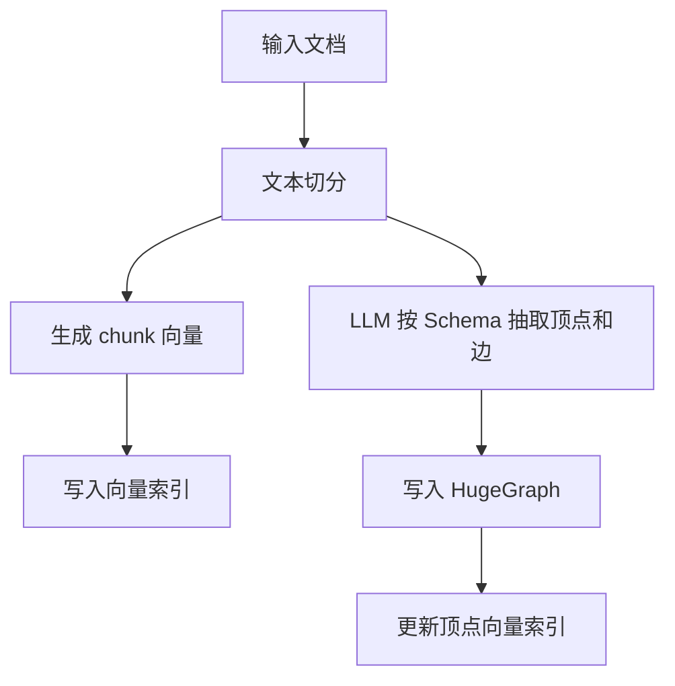
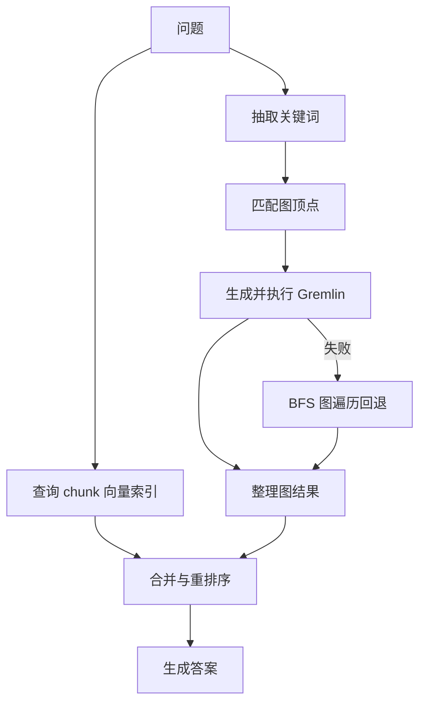

本文说明 HugeGraph-LLM Web 页面的处理流程。服务启动方式见 [HugeGraph-LLM](./hugegraph-llm.md)。

## 1. 构建 RAG 索引

第一个标签页负责两类索引：

- 将文档切分后写入 chunk 向量索引。
- 按 Schema 从文档抽取顶点和边，写入 HugeGraph，并维护顶点向量索引。



页面包含文档、Schema、抽取提示词和结果区域。常用操作有：

1. `Import into Vector`：切分文档并建立 chunk 向量索引。
2. `Extract Graph Data`：按 Schema 抽取图数据。
3. `Load into GraphDB`：把抽取结果写入 HugeGraph，并更新顶点向量。
4. `Update Vid Embedding`：重新生成顶点向量。

页面还可以查看或清除 chunk 索引、顶点索引和图数据。清除操作会删除已有数据，执行前先确认当前图和索引是否仍被其他查询使用。

## 2. GraphRAG 查询

第二个标签页提供四种回答范围：

- 直接使用 LLM 回答。
- 只使用 chunk 向量召回。
- 只使用图召回。
- 合并图召回与向量召回。



图召回先用关键词精确匹配 HugeGraph 顶点，找不到时再用顶点向量做近似匹配。匹配结果会进入 Text2Gremlin；生成或执行失败时，流程可以回退到预定义的图遍历。

`Template Num` 控制 Text2Gremlin 使用的示例数量。小于等于 0 表示不提供模板，大于 0 表示从示例索引中取相应数量的相近模板。

## 3. Text2Gremlin

第三个标签页把自然语言转换成 Gremlin：

1. 读取当前图的 Schema。
2. 从示例向量索引取回相近的自然语言与 Gremlin 对。
3. 把问题、Schema、示例和已匹配顶点填入提示词。
4. 调用 LLM 生成 Gremlin，并按所选输出类型决定是否执行。


自定义提示词必须包含 `{query}`、`{schema}`、`{example}` 和 `{vertices}`。缺少任一占位符时，REST API 会拒绝请求。

## 4. 图工具与管理工具

`Graph Tools` 标签页用于直接执行图操作。`Admin Tools` 提供日志等管理能力。启用登录后，页面和 API 需要使用 `USER_TOKEN`；日志接口还要求单独配置安全的 `ADMIN_TOKEN`。


## 5. 提示词语言

在 `hugegraph-llm/.env` 中设置：

```properties
# 英文提示词
LANGUAGE=EN

# 中文提示词
LANGUAGE=CN
```

修改后重启服务。该配置选择内置提示词语言，不会自动翻译输入文档，也不是 `/rag` 请求体字段。

## 6. REST 调用

Web 页面和 REST API 使用同一套流程。需要程序集成时使用 `/rag`、`/rag/graph`、`/graph/extract` 和 `/text2gremlin`；请求结构见 [REST API](./rest-api.md)。
