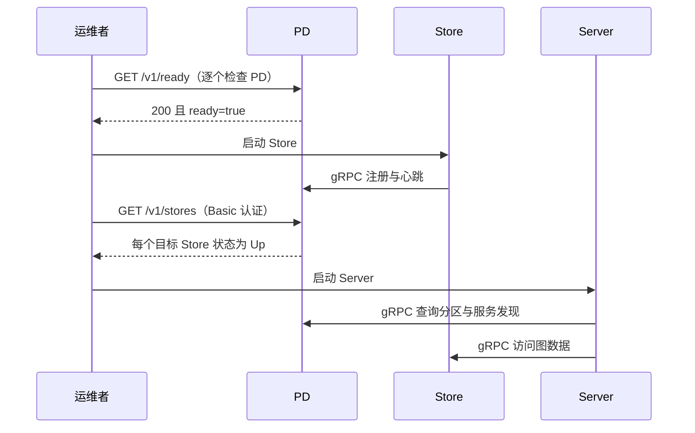

### 1 HugeGraph-PD 概述

HugeGraph-PD（Placement Driver）是 HugeGraph 分布式版本的元数据管理组件，负责管理图数据的分布和存储节点的协调。它在分布式 HugeGraph 中扮演着核心角色，维护集群状态并协调 HugeGraph-Store 存储节点。

PD 将集群元数据保存在 `pd.data-path` 下的内嵌 RocksDB 中，并通过 Raft 在各 PD 节点之间复制，因此 3 节点或 5 节点的 PD 集群在少数节点宕机时仍可继续提供服务。在此基础上，PD 还负责注册和激活 Store 节点、分配与再平衡分区、跟踪 Store 心跳，并响应来自 Store 和 Server 的服务发现请求。

PD 监听三个端口：

| 端口 | 默认值 | 配置项 | 使用方 |
|------|--------|--------|--------|
| gRPC | `8686` | `grpc.port` | Store 和 Server 客户端 |
| REST | `8620` | `server.port` | 管理接口、健康检查、监控指标 |
| Raft | `8610` | `raft.address` | 仅其他 PD 节点 |

### 2 依赖

#### 2.1 前置条件

- 操作系统：Linux 或 macOS（Windows 尚未经过完整测试）
- Java 版本：≥ 11
- Maven 版本：≥ 3.5.0

### 3 部署

有两种方式可以部署 HugeGraph-PD 组件：

- 方式 1：下载 tar 包
- 方式 2：源码编译

#### 3.1 下载 tar 包

Apache 下载页目前提供 1.7.0 的完整二进制包，其中包含 PD、Store 和 Server；没有单独列出 PD 二进制包。下载前请在 [官方 Apache HugeGraph 下载页](https://hugegraph.apache.org/cn/docs/download/download/)核对版本、签名和 SHA512。1.7.0 是孵化期发布的历史版本，归档文件和解压目录仍带 `incubating`：

```bash
# 1.7.0 是项目孵化期发布的历史版本，因此文件名和目录名仍带 incubating
wget https://downloads.apache.org/hugegraph/1.7.0/apache-hugegraph-incubating-1.7.0.tar.gz
tar zxf apache-hugegraph-incubating-1.7.0.tar.gz
cd apache-hugegraph-incubating-1.7.0/apache-hugegraph-pd-incubating-1.7.0
```

#### 3.2 源码编译

```bash
# 1. 克隆源代码
git clone https://github.com/apache/hugegraph.git

# 2. 编译项目
cd hugegraph
mvn clean install -DskipTests=true

# 3. 编译成功后，PD 目录和发布包分别位于
#    hugegraph-pd/apache-hugegraph-pd-{version}          （解压后的 PD 发布目录）
#    hugegraph-pd/apache-hugegraph-pd-{version}.tar.gz   （仅含 PD 的发布包，只在 Linux 构建机上生成）
#    target/apache-hugegraph-{version}.tar.gz            （PD + Store + Server 的完整发布包）
```

只编译 PD 发布包及其依赖模块：

```bash
mvn clean package -pl hugegraph-pd/hg-pd-dist -am -DskipTests
```

解压后的发布目录只包含三个子目录：`bin`（启停脚本）、`conf`（`application.yml`、`application.yml.template`、`log4j2.xml`、`verify-license.json`）和 `lib`（`hg-pd-service` jar 包）。

#### 3.3 Docker 部署

`HG_PD_*` 环境变量和 `/v1/ready` 是当前主线源码提供的功能；server 的 `1.7.0` 发布源码标签尚无这些 Docker 环境变量映射或 readiness API。本文下面的 Docker 示例仅适用于从当前主线源码构建并标记为 `local` 的镜像；使用 1.7.0 发布资产时，应以该版本随包配置和说明为准：

```bash
# 在 hugegraph 仓库根目录执行
docker build -f hugegraph-pd/Dockerfile -t hugegraph/pd:local .
```

单独运行当前主线构建的 PD 时，先设置部署专用密钥，并把示例地址替换为容器可达的真实地址：

```bash
export HG_PD_AUTH_SECRET_KEY="$(openssl rand -hex 24)"
docker run -d \
  -p 8620:8620 -p 8686:8686 -p 8610:8610 \
  -e HG_PD_GRPC_HOST=192.168.1.10 \
  -e HG_PD_RAFT_ADDRESS=192.168.1.10:8610 \
  -e HG_PD_RAFT_PEERS_LIST=192.168.1.10:8610 \
  -e HG_PD_INITIAL_STORE_LIST=192.168.1.20:8500 \
  -e HG_PD_AUTH_SECRET_KEY="$HG_PD_AUTH_SECRET_KEY" \
  -v /path/to/data:/hugegraph-pd/pd_data \
  --name hugegraph-pd \
  hugegraph/pd:local
```

| 变量 | 必填 | 默认值 | 对应配置项 | 描述 |
|------|------|--------|------------|------|
| `HG_PD_GRPC_HOST` | 是 | 无 | `grpc.host` | 本节点对外公布的 gRPC 主机名/IP；容器网络中应使用容器主机名。 |
| `HG_PD_RAFT_ADDRESS` | 是 | 无 | `raft.address` | 本节点 Raft 地址。 |
| `HG_PD_RAFT_PEERS_LIST` | 是 | 无 | `raft.peers-list` | 所有 PD 节点的 Raft 地址，含本节点。 |
| `HG_PD_INITIAL_STORE_LIST` | 是 | 无 | `pd.initial-store-list` | 预期的 Store gRPC 地址。 |
| `HG_PD_AUTH_SECRET_KEY` | 是 | 无 | `auth.secret-key` | REST Basic 密码；所有 PD REST 客户端都必须使用同一密钥。 |
| `HG_PD_GRPC_PORT` | 否 | `8686` | `grpc.port` | gRPC 服务端口。 |
| `HG_PD_REST_PORT` | 否 | `8620` | `server.port` | REST API 端口。 |
| `HG_PD_DATA_PATH` | 否 | `/hugegraph-pd/pd_data` | `pd.data-path` | 元数据存储路径。 |
| `HG_PD_INITIAL_STORE_COUNT` | 否 | `1` | `pd.initial-store-count` | 集群可用所需的最小 Store 数量。 |
| `HG_PD_ACTUATOR_EXPOSURE` | 否 | `health,metrics,prometheus` | `management.endpoints.web.exposure.include` | 公开的 Actuator 端点白名单；不允许设置为 `*`。 |

当前主线 entrypoint 要求以上五个必填变量，生成 `SPRING_APPLICATION_JSON` 覆盖项后再启动 PD；其他配置继续从镜像内的 `conf/application.yml` 读取。`JAVA_OPTS` 会透传给 JVM。旧变量 `GRPC_HOST`、`RAFT_ADDRESS`、`RAFT_PEERS`、`PD_INITIAL_STORE_LIST` 仍可用，但会输出弃用警告。

PD 镜像的 Docker `HEALTHCHECK` 每 15 秒检查 `/v1/health`，它只表示 REST 监听器有响应，不代表 Raft 已形成多数派。Compose 示例中的健康检查也使用这个存活接口；需要在启动 Store 前另行检查 `/v1/ready`。容器以前台方式运行，Java 退出会让容器退出；只有配置了 Docker 重启策略时容器才会自动重启。Docker 日志可通过 `docker logs <container-name>` 查看。

当前主线 Compose 的完整启动和最小拓扑见 [Store 页面](./hugegraph-hstore.md#33-docker-部署)及 [docker/README.md](https://github.com/apache/hugegraph/blob/master/docker/README.md)。Compose 文件的服务配置来自主线源码；若启动包含 Hubble 的完整拓扑，先按 `docker/README.md` 生成未跟踪的 Hubble 配置文件。

### 4 配置

PD 启动脚本读取安装目录中的 `conf/application.yml`。请使用与安装包版本相同的源文件，不要把发布版和主线配置混用： [1.7.0 发布标签配置](https://github.com/apache/hugegraph/blob/1.7.0/hugegraph-pd/hg-pd-dist/src/assembly/static/conf/application.yml)；[当前主线配置](https://github.com/apache/hugegraph/blob/master/hugegraph-pd/hg-pd-dist/src/assembly/static/conf/application.yml)。主线 `application.yml` 将 `auth.secret-key` 留空，REST 受保护接口在未设置密钥时会拒绝请求；`application.yml.template` 不由 PD 启动脚本读取。

#### 4.1 配置项参考

以下表格核对的是 server 主线提交 `2f827d6e8c9c62ae858f2fc122b3a192d015e2f4` 中的 `hg-pd-dist` 配置和 Java 默认注入值，不是 1.7.0 发布标签的全部行为。1.7.0 二进制包请使用其标签对应的原始配置；主线源码构建包则以 [主线配置文件](https://github.com/apache/hugegraph/blob/master/hugegraph-pd/hg-pd-dist/src/assembly/static/conf/application.yml) 为准。

**gRPC 与 REST**

| 配置项 | 主线目录值 | 内置默认值 | 描述 |
|--------|--------------|------------|------|
| `grpc.host` | `127.0.0.1` | 无，必填 | 本 PD 对外公布的 gRPC 地址。Store 和 Server 会连到这个地址，因此分布式部署时必须填可访问的 IPv4 地址或主机名，不能用 `127.0.0.1` 或 `0.0.0.0`。 |
| `grpc.port` | `8686` | 无，必填 | gRPC 端口。 |
| `server.port` | `8620` | 无，必填 | REST API 端口，同时也是 Raft 成员信息中公布的 REST 端口。 |

`application.yml.template` 中还有 `grpc.netty-server.max-inbound-message-size: 100MB`，但 PD 在代码中把 gRPC 服务端的入站消息上限固定为 1 GB，该配置项实际不生效。

**Raft**

| 配置项 | 主线目录值 | 内置默认值 | 描述 |
|--------|--------------|------------|------|
| `raft.address` | `127.0.0.1:8610` | 无，必填 | 本节点的 Raft 地址，格式为 `host:port`。每个节点必须不同，且必须出现在 `raft.peers-list` 中。 |
| `raft.peers-list` | `127.0.0.1:8610` | 无，必填 | 逗号分隔的全部 PD 节点 Raft 地址（含本节点）。所有节点上必须完全一致。 |
| `raft.enable` | 未设置 | `true` | 为 true 时元数据写入经过 Raft 状态机；为 false 时 PD 直接写本地存储，不做复制。 |
| `raft.ip-whitelist.enabled` | 未设置 | `true` | 为 true 时 Raft RPC 端口只接受由 `raft.peers-list` 解析出的地址的连接，其他连接会被断开并记录 `Blocked connection from <ip>`。peer 列表变更时白名单会重新解析，但主机名不变而 IP 变化的情况（例如容器重启）仍需重启 PD。 |
| `raft.snapshotInterval` | 未设置 | `300` | Raft 快照生成间隔（秒）。 |
| `raft.rpc-timeout` | 未设置 | `10000` | Raft RPC 的连接、请求和安装快照超时时间（毫秒）。 |

**PD 核心**

| 配置项 | 主线目录值 | 内置默认值 | 描述 |
|--------|--------------|------------|------|
| `pd.data-path` | `./pd_data` | 无，必填 | 元数据目录。`rocksdb/` 子目录存放 RocksDB 数据，`pd_raft/` 子目录存放 Raft 日志、元信息和快照。 |
| `pd.patrol-interval` | `1800` | `300` | 巡检周期（秒）。巡检会检查各 Store 上的分区健康状况并平衡分区数量。 |
| `pd.initial-store-count` | `1` | `3` | 活跃 Store 节点的最小数量。低于该值时集群状态变为 `Cluster_Not_Ready`，整个集群视为不可用。建议设为实际部署的 Store 数量。 |
| `pd.initial-store-list` | `127.0.0.1:8500` | 空 | 逗号分隔的 Store gRPC 地址（`ip:port`），列表中的 Store 注册后自动激活。条目也可以带分组 id，写作 `store_address/group_id`。 |
| `pd.cluster_id` | 未设置 | `1` | 集群 id，用于区分不同的 PD 集群。 |

**Store 管理**

| 配置项 | 主线目录值 | 内置默认值 | 描述 |
|--------|--------------|------------|------|
| `store.keepAlive-timeout` | 未设置 | `300` | 心跳超时时间（秒）。超过该时间未收到心跳，Store 视为临时不可用，其分区 leader 转移到其他副本。 |
| `store.max-down-time` | `172800` | `1800` | 超过该时间（秒）后 Store 视为永久不可用，其副本重新分配到其他机器。 |
| `store.monitor_data_enabled` | `true` | `false` | 是否持久化 Store 监控采样数据。 |
| `store.monitor_data_interval` | `1 minute` | `1 minute` | 采样间隔，格式为 `<数字> <单位>`，单位为 `second`、`minute`、`hour`、`day`、`month`、`year` 之一；省略数字时按 1 计。 |
| `store.monitor_data_retention` | `1 day` | `1 day` | 监控数据保留时长，格式同上。 |

**分区**

| 配置项 | 主线目录值 | 内置默认值 | 描述 |
|--------|--------------|------------|------|
| `partition.default-shard-count` | `1` | `3` | 每个分区的副本数。生产集群建议设为 `3`。 |
| `partition.store-max-shard-count` | `12` | `24` | 单个 Store 最多承载的分区副本数。 |

初始分区数由这两个配置项和 `pd.initial-store-list` 的长度推导得出：

```text
初始分区数 = Store 数量 * partition.store-max-shard-count / partition.default-shard-count
```

**服务发现、License 与监控**

| 配置项 | 主线目录值 | 内置默认值 | 描述 |
|--------|--------------|------------|------|
| `discovery.heartbeat-try-count` | 未设置 | `3` | 客户端注册后连续丢失多少次心跳就删除其注册信息。 |
| `license.verify-path` | `./conf/verify-license.json` | 无，配置键必填 | PD 发行目录随包提供该 JSON 文件；当前主线代码没有读取此配置项的运行时位置。 |
| `license.license-path` | `./conf/hugegraph.license` | 无，配置键必填 | 目标路径不会随包带入 license 文件；内部 gRPC `putLicense` 会把上传内容写到此处。当前主线的 REST `GET /v1/license` 返回空对象，不因文件缺失而阻止 PD 启动。 |
| `auth.secret-key` | 空 | 空 | 当前主线的 PD REST Basic 密码；合法用户名为 `hg`、`store`、`hubble`、`vermeer`。Docker 镜像要求设置；裸机 PD 可在密钥为空时启动，但受保护 REST 请求都会被拒绝。 |
| `management.metrics.export.prometheus.enabled` | `true` | Spring Boot 默认值 | 是否暴露 `/actuator/prometheus`。 |
| `management.endpoints.web.exposure.include` | `health,metrics,prometheus` | Spring Boot 默认只暴露 `health` | Actuator 暴露白名单；这些端点不经过 PD REST Basic 拦截器。 |
| `logging.config` | `file:./conf/log4j2.xml` | 无 | Log4j2 配置文件，会写出 `logs/hugegraph-pd.log`、`logs/hugegraph-pd_raft.log` 和 `logs/audit-hugegraph-pd.log`。 |

**线程池**

| 配置项 | 内置默认值 | 描述 |
|--------|------------|------|
| `thread.pool.grpc.core` | `600` | 处理 gRPC 请求的线程池核心线程数。 |
| `thread.pool.grpc.max` | `1000` | 该线程池的最大线程数。 |
| `thread.pool.grpc.queue` | 无上限 | 该线程池的队列容量。 |
| `job.uninterruptibleThreadPool.core` | `0` | 元数据后台任务线程池的核心线程数。小于等于 0 时取可用处理器数的一半。 |
| `job.uninterruptibleThreadPool.max` | `256` | 该线程池的最大线程数。 |
| `job.uninterruptibleThreadPool.queue` | 无上限 | 该线程池的队列容量。 |

#### 4.2 单节点配置

在主线源码构建的发布目录中，以 `conf/application.yml` 为基础，只需按节点改写 gRPC/Raft 地址和数据路径，并设置 `auth.secret-key`。以下值仅适用于开发测试；单节点 PD 不提供多数派容错，`partition.default-shard-count: 1` 表示每个分区只有一个副本。

```yaml
grpc:
  host: 127.0.0.1
  port: 8686
server:
  port: 8620
raft:
  address: 127.0.0.1:8610
  peers-list: 127.0.0.1:8610
pd:
  data-path: ./pd_data
  initial-store-count: 1
  initial-store-list: 127.0.0.1:8500
partition:
  default-shard-count: 1
auth:
  secret-key: 替换为部署专用密钥
```

可以用 `openssl rand -hex 24` 生成部署密钥；使用 Docker 时通过 `HG_PD_AUTH_SECRET_KEY` 传入。1.7.0 发布标签的认证行为不同，详见“REST API 认证”。

#### 4.3 三节点集群配置

生产环境请部署 3 个或 5 个 PD 节点，节点数取奇数以保证 Raft 总能形成多数派。3 节点集群可容忍 1 个节点故障。`raft.peers-list` 必须列出全部节点，并且在所有节点上逐字节一致；`grpc.host` 和 `raft.address` 每个节点各不相同。

节点 1（`192.168.1.10`）：

```yaml
grpc:
  host: 192.168.1.10
  port: 8686
server:
  port: 8620
raft:
  address: 192.168.1.10:8610
  peers-list: 192.168.1.10:8610,192.168.1.11:8610,192.168.1.12:8610
pd:
  data-path: /data/pd
  initial-store-count: 3
  initial-store-list: 192.168.1.20:8500,192.168.1.21:8500,192.168.1.22:8500
partition:
  default-shard-count: 3
```

节点 2（`192.168.1.11`）和节点 3（`192.168.1.12`）使用同一份配置，只把 `grpc.host` 和 `raft.address` 换成自己的地址：

```yaml
# 节点 2
grpc:
  host: 192.168.1.11
raft:
  address: 192.168.1.11:8610
  peers-list: 192.168.1.10:8610,192.168.1.11:8610,192.168.1.12:8610

# 节点 3
grpc:
  host: 192.168.1.12
raft:
  address: 192.168.1.12:8610
  peers-list: 192.168.1.10:8610,192.168.1.11:8610,192.168.1.12:8610
```

若要在同一台机器上启动 3 个 PD 节点做测试，需为每个节点分别指定 `pd.data-path` 和各自的端口，例如 raft 端口 `8610/8611/8612`、gRPC 端口 `8686/8687/8688`、REST 端口 `8620/8621/8622`。

在 Docker 桥接网络中，同样的配置来自环境变量，并使用容器主机名而非 IP 地址：

```yaml
# 所有 PD 节点共用同一个密钥，实际部署从私密环境变量注入
HG_PD_AUTH_SECRET_KEY: ${HG_PD_AUTH_SECRET_KEY:?set HG_PD_AUTH_SECRET_KEY}

# pd0
HG_PD_GRPC_HOST: pd0
HG_PD_RAFT_ADDRESS: pd0:8610
HG_PD_RAFT_PEERS_LIST: pd0:8610,pd1:8610,pd2:8610
HG_PD_INITIAL_STORE_LIST: store0:8500,store1:8500,store2:8500
HG_PD_INITIAL_STORE_COUNT: 3

# pd1
HG_PD_GRPC_HOST: pd1
HG_PD_RAFT_ADDRESS: pd1:8610
HG_PD_RAFT_PEERS_LIST: pd0:8610,pd1:8610,pd2:8610

# pd2
HG_PD_GRPC_HOST: pd2
HG_PD_RAFT_ADDRESS: pd2:8610
HG_PD_RAFT_PEERS_LIST: pd0:8610,pd1:8610,pd2:8610
```

### 5 启动与停止

#### 5.1 启动 PD

在 PD 安装目录下执行：

```bash
./bin/start-hugegraph-pd.sh
```

脚本要求 `PATH` 或 `JAVA_HOME` 中有 11 及以上版本的 JDK；如果发现已有 Java 进程在使用本安装目录的 `conf` 目录，脚本会直接退出，不做任何事。

支持的参数：

| 参数 | 取值 | 默认值 | 描述 |
|------|------|--------|------|
| `-d` | `true`、`false` | `true` | 守护进程模式，详见下文。 |
| `-g` | `zgc`、`ZGC` | 不设置 | 垃圾回收器。不带该参数即使用默认的 G1GC；填其他值（包括 `g1`）会导致启动中止。 |
| `-j` | JVM 参数 | 空 | 额外的 JVM 参数，例如 `-j "-Xmx8g -Xms8g"`。 |
| `-y` | `true`、`false` | `false` | 挂载 OpenTelemetry Java agent。首次使用时会把 agent 下载到 `plugins/` 并校验 MD5，trace 通过 gRPC 上报到 `http://127.0.0.1:4317`。 |

`-d` 参数控制守护进程模式：

- `-d true`（默认）：以后台守护进程方式运行，脚本立即返回。
- `-d false`：以前台模式运行，脚本通过 `exec` 替换为 Java 进程，容器/进程管理器的进程即为 Java 本身。在 Docker 或进程管理器（systemd、supervisord）下运行时请使用此参数，以便在崩溃时自动检测并重启服务。

每个参数都有对应的环境变量：`DAEMON`、`GC_OPTION`、`USER_OPTION` 和 `OPEN_TELEMETRY`。设置 `JAVA_OPTIONS` 会完全替换脚本计算出的堆参数，否则脚本会根据可用内存在 512 MB 到 32 GB 之间选择堆大小。设置 `STDOUT_MODE=true` 时 JVM 输出保留在 stdout，不再重定向到 `logs/hugegraph-pd-stdout.log`，Docker 镜像正是这样做的。

启动成功后，可以在 `logs/hugegraph-pd-stdout.log` 中看到类似以下的日志：

```
YYYY-mm-dd xx:xx:xx [main] [INFO] o.a.h.p.b.HugePDServer - Started HugePDServer in x.xxx seconds (JVM running for x.xxx)
```

进程号会写入 `bin/pid`。

#### 5.2 停止 PD

在 PD 安装目录下执行：

```bash
./bin/stop-hugegraph-pd.sh
```

脚本读取 `bin/pid`，向该进程发送终止信号，最多等待 30 秒直到进程退出，然后删除 pid 文件。如果 `bin/pid` 不存在，脚本会提示并正常退出。

### 6 分布式集群的启动顺序

请按以下顺序启动各组件：

1. **全部 PD 节点**。它们组成 Raft 组并选出 leader。对每个节点检查 `GET /v1/ready`；仅当 HTTP 状态为 `200` 且响应中的 `ready` 为 `true` 时，再启动 Store。`GET /v1/health` 只检查 REST 监听器是否存活。
2. **全部 Store 节点**。每个 Store 通过 gRPC 向 PD 注册，PD 会自动激活 `pd.initial-store-list` 中列出的 Store。等到 `GET /v1/stores` 中每个 Store 的 `state` 都是 `Up` 再继续。
3. **全部 Server 节点**。Server 读取 `pd.peers`，并依赖 PD 报告至少有一个存活的 Store 才能完成分区分配。



主线 Compose 中 Store 的 `depends_on: condition: service_healthy` 只等待 PD `/v1/health` 存活检查，Server 同样只等待 Store REST 存活检查；Server entrypoint 还会轮询 PD `/v1/stores`，直到有 Store 报告 `Up` 才启动 HugeGraph。`docker compose up --wait` 因而不能替代 PD Raft 就绪与 Store 注册状态检查。

停止时顺序相反：先停 Server，再停 Store，最后停 PD。

### 7 验证

#### 7.1 REST API 认证

当前主线除 `/actuator/*`、`/v1/health`、`/v1/ready` 和 `/v1/prom/targets/*` 之外，所有 PD REST 路径都要求 HTTP Basic `Authorization`。用户名必须是内部服务名 `hg`、`store`、`hubble`、`vermeer` 之一，密码必须等于 `auth.secret-key`；无密钥或密码不匹配时会返回 HTTP `401`。用启动 PD 时的同一密钥检查 Store 列表：

```json
{"status": -1, "error": "Unauthorized"}
```

```bash
curl -u "store:${HG_PD_AUTH_SECRET_KEY:?请先设置 PD 部署密钥}" \
  http://localhost:8620/v1/stores
```

`bin/wait-storage.sh` 通过 `PD_AUTH_USER`、`PD_AUTH_PASSWORD` 配置同一凭据。1.7.0 发布标签的认证实现只检查用户名是否属于内部服务名，不比较密码；不要把该旧版行为套用到当前主线源码构建包。

> **警告**：该校验只用于区分 HugeGraph 自身组件与其他流量。请勿把 PD 的 REST 或 gRPC 端口暴露到不可信网络，应通过防火墙规则或安全组加以限制，并保持 `raft.ip-whitelist.enabled` 开启，使 Raft 端口只接受配置中的 peer。

#### 7.2 健康检查

`GET /v1/health` 不需要凭据，返回 `200` 且响应体为空，只表示 PD REST 监听器已启动：

```bash
curl -i http://localhost:8620/v1/health
```

Spring Boot actuator 端点同样可用，输出更直观：

```bash
curl http://localhost:8620/actuator/health
```

`/actuator/health` 的 `{"status":"UP"}` 也不代表 PD Raft 集群已有可用 leader。主线新增的 `GET /v1/ready` 会在 PD Raft 节点已激活并能看到 leader 时返回 HTTP `200` 和 `ready:true`；尚未就绪时返回 HTTP `503` 和 `ready:false`：

```bash
curl -i http://localhost:8620/v1/ready
```

#### 7.3 集群与成员状态

查看 PD 成员以及当前的 Raft leader：

```bash
curl -u "store:${HG_PD_AUTH_SECRET_KEY:?请先设置 PD 部署密钥}" \
  http://localhost:8620/v1/members
```

响应中包含 `pdList`、选出的 `pdLeader`、`numOfService`、`numOfNormalService` 和 `stateCountMap`。健康的 3 节点 PD 集群中，`numOfService` 和 `numOfNormalService` 都应为 `3`，且恰好有一个成员的 `role` 为 `Leader`。

`GET /v1/cluster` 在成员列表之外还返回 Store 列表、图列表和集群整体状态；`GET /` 返回一份简要汇总（leader 地址、集群状态、成员数、Store 数、图数量、分区数）。

#### 7.4 Store 状态

也可以通过 PD API 查看 Store 节点状态：

```bash
curl -u "store:${HG_PD_AUTH_SECRET_KEY:?请先设置 PD 部署密钥}" \
  http://localhost:8620/v1/stores
```

如果响应中 `state` 为 `Up`，说明对应的 Store 节点运行正常。下面的示例只有一个 Store 节点。在一个健康的 3 节点部署中，`storeId` 列表应包含 3 个 ID，且 `stateCountMap.Up`、`numOfService` 和 `numOfNormalService` 都应为 `3`。

```javascript
{
  "message": "OK",
  "data": {
    "stores": [
      {
        "storeId": 8319292642220586694,
        "address": "127.0.0.1:8500",
        "raftAddress": "127.0.0.1:8510",
        "version": "",
        "state": "Up",
        "deployPath": "/Users/{your_user_name}/hugegraph/apache-hugegraph-incubating-1.7.0/apache-hugegraph-store-incubating-1.7.0/lib/hg-store-node-1.7.0.jar",
        "dataPath": "./storage",
        "startTimeStamp": 1754027127969,
        "registedTimeStamp": 1754027127969,
        "lastHeartBeat": 1754027909444,
        "capacity": 494384795648,
        "available": 346535829504,
        "partitionCount": 0,
        "graphSize": 0,
        "keyCount": 0,
        "leaderCount": 0,
        "serviceName": "127.0.0.1:8500-store",
        "serviceVersion": "",
        "serviceCreatedTimeStamp": 1754027127000,
        "partitions": []
      }
    ],
    "stateCountMap": {
      "Up": 1
    },
    "numOfService": 1,
    "numOfNormalService": 1
  },
  "status": 0
}
```

#### 7.5 其他 REST 接口

下表中的路径均相对于 `http://<pd-host>:8620`，除注明外都需要 7.1 中的 Basic 认证头。

| 方法与路径 | 描述 |
|------------|------|
| `GET /` | 集群简要统计：leader、状态、成员数、Store 数、图数量、分区数 |
| `GET /v1/health` | 存活检查；HTTP 200 不代表 Raft 就绪，无需认证 |
| `GET /v1/ready` | Raft readiness；HTTP 200 且 `ready:true` 表示本节点已激活并看到 leader，无需认证（当前主线） |
| `GET /v1/cluster` | 集群完整统计：PD 成员、Store、图、分区 |
| `GET /v1/members` | PD 成员列表，含角色和选出的 leader |
| `POST /v1/members/change` | 修改 Raft peer 列表，请求体 `{"peerList": "..."}` |
| `GET /v1/stores` | 已注册的 Store 节点及其状态和统计信息 |
| `GET /v1/store/{storeId}` | 单个 Store 节点 |
| `POST /v1/store/{storeId}` | 修改 Store 状态，请求体 `{"storeState": "..."}` |
| `DELETE /v1/store/{storeId}` | 从集群中移除 Store |
| `POST /v1/store/log` | Store 状态变更日志，请求体 `{"startTime": "...", "endTime": "..."}` |
| `GET /v1/storesAndStats` | Store 原始元数据，用于调试 |
| `GET /v1/store_monitor/{storeId}` | Store 监控采样数据（文本） |
| `GET /v1/store_monitor/json/{storeId}` | Store 监控采样数据（JSON） |
| `GET /v1/shards` | 所有分区的所有副本，含 store id、角色、状态和进度 |
| `GET /v1/shardGroups` | Shard 分组 |
| `GET /v1/shardGroupsCache` | PD 内存缓存中的 shard 分组 |
| `GET /v1/shardLeaders` | 按 Store raft 地址分组的分区 leader |
| `GET /v1/balanceLeaders` | 在各 Store 之间重新平衡分区 leader |
| `GET /v1/partitions` | 分区列表及其状态和统计信息 |
| `GET /v1/highLevelPartitions` | 分区列表，含各图的 key 数量和数据大小 |
| `GET /v1/partitionsAndStats` | 分区原始元数据，用于调试 |
| `POST /v1/partitions/log` | 分区变更日志，请求体 `{"startTime": "...", "endTime": "..."}` |
| `GET /v1/resetPartitionState` | 重置所有分区的状态 |
| `GET /v1/graphs` | 图列表 |
| `GET /v1/graph/**` | 按名称查询单个图 |
| `POST /v1/graph/**` | 修改图的分区数，请求体 `{"partitionCount": N}` |
| `GET /v1/graph/partitionSizeRange` | 集群允许的分区数上下限 |
| `GET /v1/graph-spaces` | 图空间列表 |
| `GET /v1/graph-spaces/**` | 单个图空间 |
| `POST /v1/graph-spaces/**` | 修改图空间 |
| `POST /v1/registry` | 注册一个服务实例用于服务发现 |
| `POST /v1/registryInfo` | 查询已注册的实例 |
| `GET /v1/allInfo` | 所有已注册的实例 |
| `GET /v1/license` | 旧接口，当前主线返回空对象 |
| `GET /v1/license/machineInfo` | License 校验看到的 IP 和 MAC 地址 |
| `GET /v1/task/patrolStores` | 立即执行 Store 巡检任务 |
| `GET /v1/task/patrolPartitions` | 立即执行分区巡检任务 |
| `GET /v1/task/balancePartitions` | 在各 Store 之间重新平衡分区 |
| `GET /v1/task/splitPartitions` | 立即执行自动分区拆分 |
| `GET /v1/task/balanceLeaders` | 重新平衡分区 leader |
| `GET /v1/task/compact` | 让 Store 节点对其分区的 RocksDB 文件做 compaction |
| `GET /v1/prom/targets/{appName}` | Prometheus 服务发现目标，无需认证 |
| `GET /v1/prom/targets-all` | 所有应用类型的 Prometheus 目标 |
| `GET /v1/prom/sd_config` | Prometheus HTTP 服务发现配置 |
| `GET /actuator/health` | Spring Boot 健康检查，无需认证 |
| `GET /actuator/metrics` | Spring Boot 监控指标，无需认证 |
| `GET /actuator/prometheus` | Prometheus 抓取端点，无需认证 |

两个 `log` 接口接受形如 `{"startTime": "...", "endTime": "..."}` 的时间范围，`yyyy-MM-dd HH:mm:ss` 和 `yyyy-MM-dd` 都是可接受的格式。

PD 以 `hg` 前缀注册自己的指标，因此 `/actuator/prometheus` 除标准 JVM 指标外还会暴露 `hg_up`、`hg_graphs`、`hg_stores` 和 `hg_terms`，在存在图之后还会有按图统计的分区和大小指标。
