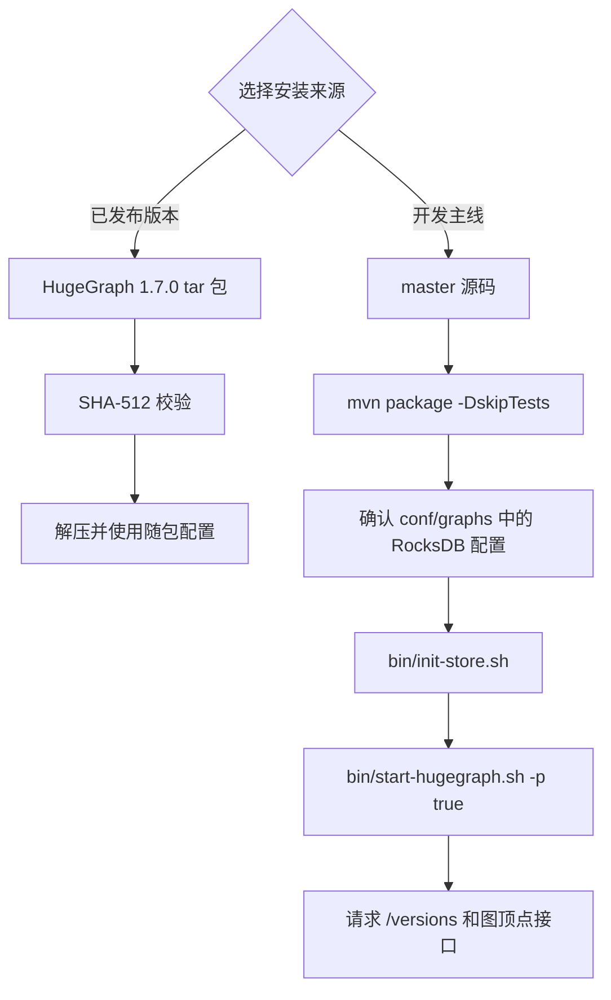

## 1 HugeGraph Server 概述

`apache/hugegraph` 是 HugeGraph 图数据库的主仓库，包含 `hugegraph-server`、`hugegraph-pd`、`hugegraph-store` 等一级模块。本页介绍其中的 `hugegraph-server` 模块及其运行服务。

`hugegraph-server` 模块包含 `hugegraph-core`、`hugegraph-api`、`hugegraph-dist` 和存储适配等子模块。Core 实现属性图模型、事务与 TinkerPop 接口，API 提供 HTTP 服务并将客户端请求交给 Core 处理。图数据由 RocksDB（单机默认）、HStore（分布式）或 HBase 后端保存。

> ⚠️ **版本说明**：本文区分已发布版本与开发主线。下载示例使用 ASF 发布的 HugeGraph 1.7.0 安装包；源码构建、配置默认值和启动行为以 `apache/hugegraph` 的 `master` 分支为准。主线源码构建出的包不是 ASF 发布包，即使包内版本号相同也不代表与 1.7.0 发布包相同。本文介绍 RocksDB、HStore 和 HBase；其他旧后端请参考 [HugeGraph 1.5.x 文档](https://github.com/apache/hugegraph-doc/blob/release-1.5.0/content/cn/docs/quickstart/hugegraph/hugegraph-server.md)。

> 名称说明：`HugeGraph` 表示整个项目或主仓库，`hugegraph-server` 表示仓库中的 Server 模块，`HugeGraphServer` 是服务进程的 Java 类名。下文的 Server 服务指运行中的图数据库服务。



## 2 依赖

### 2.1 安装 Java 11 (JDK 11)

HugeGraph 1.7.0 中的 `hugegraph-server` 模块使用 Java 11 编译，运行和源码构建均需使用 Java 11 或更高版本。

**在继续阅读前，请先执行 `java -version` 命令确认 JDK 版本。**

> 1.7.0 起不再支持 Java 8。`bin/hugegraph-server.sh` 在低于 Java 11 的环境下会直接拒绝启动。

> 安全检查默认开启，会安装 `HugeSecurityManager`，它要求 Java 11 到 23。JDK 24 移除了 Security Manager（[JEP 486](https://openjdk.org/jeps/486)），因此在 Java 24 及更高版本上必须关闭该检查后再启动服务：`bin/start-hugegraph.sh -s false`。

> 源码构建还需要 Maven 3.5.0 或更高版本。

## 3 部署

有四种方式可以部署 Server 服务：

1. 使用 Docker 容器进行测试或开发。
1. 下载二进制 tar 包。
1. 从源码编译。
1. 使用已过时的一键部署工具。
{.steps}

> 不要把 Gremlin、Cypher 等查询接口直接暴露到公网。生产环境应启用[认证与授权](/cn/docs/config/config-authentication/)，限制网络访问并保留审计日志；部署建议见[安全指南](/cn/docs/guides/security/)。

### 3.1 使用 Docker 容器 (便于**测试**)
<!-- 3.1 is linked by another place. if change 3.1's title, please check -->

可参考 [Docker 部署方式](https://github.com/apache/hugegraph/blob/master/docker/README.md)。

可以使用 `docker run -itd --name=server -p 8080:8080 -e PASSWORD=xxx hugegraph/hugegraph:1.7.0` 快速启动一个使用 `RocksDB` 后端的 Server 实例。

可选项：

1. 可以使用 `docker exec -it server bash` 进入容器执行运维或调试操作。
2. 可以使用 `docker run -itd --name=server -p 8080:8080 -e PRELOAD="true" hugegraph/hugegraph:1.7.0` 在启动时预加载一个**内置**样例图。可通过 `RESTful API` 进行验证，具体步骤可参考 [5.1.4](#514-%E5%90%AF%E5%8A%A8-server-%E7%9A%84%E6%97%B6%E5%80%99%E5%88%9B%E5%BB%BA%E7%A4%BA%E4%BE%8B%E5%9B%BE)。
3. 可以使用 `-e PASSWORD=xxx` 开启鉴权模式并设置 admin 密码，具体步骤可参考 [Config Authentication](/cn/docs/config/config-authentication#使用-docker-时开启鉴权模式)。

如果使用 Docker Desktop，则可以按如下方式设置相关选项：
<div style="text-align: center;">
    
</div>


> **注意**：Docker Compose 文件使用桥接网络（`hg-net`），适用于 Linux 和 Mac（Docker Desktop）。如需运行 3 节点分布式集群，请为 Docker Desktop 分配至少 **12 GB** 内存（设置 → 资源 → 内存）。Linux 上 Docker 直接使用宿主机内存。

如果希望通过一个配置文件统一管理 HugeGraph 的多个服务实例，则可以使用 `docker compose`。
[`docker/`](https://github.com/apache/hugegraph/tree/master/docker) 目录下提供了四个 compose 文件：

| 拓扑 | compose 文件 | 服务 |
|---|---|---|
| 单机（推荐从这里开始） | `docker-compose.yml` | 1 个 RocksDB Server + 1 个 Hubble |
| 最小 HStore（当前主线） | `docker-compose-hstore.yml` | 1 PD + 1 Store + 1 Server + 1 Hubble；需使用主线构建的本地镜像 |
| HA 参考（当前主线） | `docker-compose-3pd-3store-3server.yml` | 3 PD + 3 Store + 3 Server + 1 Hubble；需使用主线构建的本地镜像 |
| 最小 HStore 拓扑的源码构建覆盖文件 | `docker-compose.dev.yml` | （需与 `docker-compose-hstore.yml` 一起使用） |

```bash {wrap=true}
cd hugegraph/docker
# 注意版本号请随时保持更新 → 1.x.0
HUGEGRAPH_VERSION=1.7.0 docker compose -f docker-compose.yml up -d --wait
```

单机拓扑将 Server 暴露在 `8080` 端口，Hubble 暴露在 `127.0.0.1:8088`。`HUGEGRAPH_VERSION` 决定 Server、PD 和 Store 的镜像 tag，Hubble 由 `HUBBLE_IMAGE` 单独选择。

单机 `docker-compose.yml` 示例使用 HugeGraph 1.7.0 版本镜像 `hugegraph/hugegraph:1.7.0`；该文件引用的 `docker/conf/hubble/standalone.properties` 已随源码提供。Compose 文件从 `HUGEGRAPH_ADMIN_PASSWORD` 读取管理员密码，从 `HUGEGRAPH_AUTH_TOKEN_SECRET` 读取 JWT 密钥，通常放在 `docker/.env` 文件中。`HUGEGRAPH_ADMIN_PASSWORD` 非空即开启鉴权，Hubble 会自动识别该模式。若直接使用 `docker run`，则改为传入 `-e PASSWORD=xxx`。HStore Compose 文件属于当前主线，不能与 1.7.0 的 PD/Store/Server 发布镜像混用，见下文。

**JWT 密钥的版本差异**：当前主线构建的 Server 镜像会把 `HUGEGRAPH_AUTH_TOKEN_SECRET` 映射到 `HG_SERVER_AUTH_TOKEN_SECRET`，并写入 Server 启动配置；跨重建时应在 `.env` 中保留同一密钥。1.7.0 镜像的 [Docker 入口脚本](https://github.com/apache/hugegraph/blob/1.7.0/hugegraph-server/hugegraph-dist/docker/docker-entrypoint.sh)只处理 `PASSWORD` 等旧变量，不会读取 `HG_SERVER_AUTH_TOKEN_SECRET`。如需在 1.7.0 中固定 JWT 密钥，须将 [`auth.token_secret`](https://github.com/apache/hugegraph/blob/1.7.0/hugegraph-server/hugegraph-core/src/main/java/org/apache/hugegraph/config/AuthOptions.java) 持久写入该版本的 `conf/graphs/hugegraph.properties`；若保留默认随机密钥，不应假定已有 JWT 在 Server 重启后仍有效。

完整的部署指南请参阅 [docker/README.md](https://github.com/apache/hugegraph/blob/master/docker/README.md)。

> 注意：
> 
> 1. HugeGraph 的 Docker 镜像主要用于便捷地快速启动 HugeGraph，并不是 **ASF 官方发布物料包**。你可以从 [ASF Release Distribution Policy](https://infra.apache.org/release-distribution.html#dockerhub) 中了解更多细节。
>
> 2. 推荐使用 `release tag` (如 `1.7.0/1.x.0`) 以获取稳定版。使用 `latest` tag 可以使用开发中的最新功能。

### 3.2 下载已发布的 tar 包

以下示例针对 HugeGraph 1.7.0。使用其他版本时，请先在 [ASF 下载目录](https://downloads.apache.org/hugegraph/) 确认该版本及对应文件名；不要把 `master` 源码构建包当作已发布的二进制包。

```bash {filename="download-release.sh" wrap=true collapse=2}
cd /path/to/downloads
wget https://downloads.apache.org/hugegraph/1.7.0/apache-hugegraph-incubating-1.7.0.tar.gz
wget https://downloads.apache.org/hugegraph/1.7.0/apache-hugegraph-incubating-1.7.0.tar.gz.sha512
sha512sum -c apache-hugegraph-incubating-1.7.0.tar.gz.sha512
tar zxf apache-hugegraph-incubating-1.7.0.tar.gz
```

SHA-512 校验通过后再解压。也可按 Apache 发布流程验证 PGP 签名：

```bash
wget https://downloads.apache.org/hugegraph/1.7.0/apache-hugegraph-incubating-1.7.0.tar.gz.asc
wget https://downloads.apache.org/hugegraph/KEYS
gpg --import KEYS
gpg --verify apache-hugegraph-incubating-1.7.0.tar.gz.asc apache-hugegraph-incubating-1.7.0.tar.gz
```

只应信任通过 Apache 项目渠道核实的发布者密钥；签名验证可与 SHA-512 校验一起使用。

### 3.3 从 `master` 源码构建

下面的命令构建的是开发主线，不是 1.7.0 发布包。

源码编译前请确保本机有安装 `wget/curl` 命令

下载 HugeGraph 源代码

```bash {filename="build-from-source.sh" wrap=true collapse=2}
git clone --branch master https://github.com/apache/hugegraph.git
```

编译打包生成 tar 包

```bash
cd hugegraph
# (Optional) use "-P stage" param if you build failed with the latest code(during pre-release period)
mvn package -DskipTests -ntp
```

构建成功时日志中会出现：

```bash
[INFO] BUILD SUCCESS
```

执行成功后，根目录 `target/` 下会生成主线聚合包（当前仓库版本属性为 1.7.0）：

```text
target/apache-hugegraph-1.7.0.tar.gz
```

该文件名中的版本号来自源码的 `revision` 属性；它不会把主线构建变成 ASF 发布物料。构建过程还会在仓库根目录生成 `apache-hugegraph-1.7.0/` 聚合目录，其中的 Server 子目录名由 Server 模块的 `final.name` 决定，例如当前为 `apache-hugegraph-server-1.7.0`。若只保留了 tar 包，则先执行 `tar zxf target/apache-hugegraph-1.7.0.tar.gz` 再进入该目录。

默认构建会打包 `rocksdb`、`hbase` 和 `hstore` 三个后端模块，并把它们记录在 `hugegraph-dist` jar 内的 `backend.properties` 资源的 `backends` 配置项中。若只需要包含 RocksDB 的精简发布包，可加上 `-Drocksdb-only`：

```bash
mvn package -DskipTests -ntp -Drocksdb-only
```

> [!DETAILS]- 过时的 tools 工具安装
> #### 3.4 使用 tools 工具部署 (Outdated)
>
> HugeGraph-Tools 提供一键部署命令，可以下载、解压、配置并启动 Server 服务和 HugeGraph-Hubble。HugeGraph-Toolchain 发布包中已包含这些工具。
>
> ```bash
> # download toolchain package, it includes loader + tool + hubble, please check the latest version (here is 1.7.0)
> wget https://downloads.apache.org/hugegraph/1.7.0/apache-hugegraph-toolchain-incubating-1.7.0.tar.gz
> tar zxf *hugegraph-*.tar.gz
> # enter the tool's package
> cd *hugegraph*/*tool*
> ```
>
> > 注：`${version}` 为版本号，最新版本号可参考 [Download 页面](/docs/download/download)，或直接从 Download 页面点击链接下载
>
> HugeGraph-Tools 的总入口脚本是 `bin/hugegraph`，用户可以使用 `help` 子命令查看其用法，这里只介绍一键部署的命令。
>
> ```bash
> bin/hugegraph deploy -v {hugegraph-version} -p {install-path} [-u {download-path-prefix}]
> ```
>
> `{hugegraph-version}` 表示要部署的 Server 服务及 HugeGraphStudio 版本，可在 `conf/version-mapping.yaml` 中查看版本信息。`{install-path}` 指定安装目录，`{download-path-prefix}` 可选，用于指定 tar 包下载地址。例如部署 0.6 版本时，可以执行 `bin/hugegraph deploy -v 0.6 -p services`。

## 4 配置

Server 的 tar 包随包提供 `conf/rest-server.properties`、`conf/gremlin-server.yaml` 和 `conf/graphs/hugegraph.properties`；源码构建包从 `hugegraph-server/hugegraph-dist/src/assembly/static/conf/` 装配这些文件。解压后在 Server 安装目录内编辑配置，无需另行生成。发行包版本之间可能有默认值差异，下面涉及的默认值和启动行为按 `master` 主线说明。

单机 RocksDB 快速开始只需确认 `conf/graphs/hugegraph.properties` 使用 `backend=rocksdb`、`serializer=binary`。正常 Server 初始化会扫描 `conf/graphs/` 并加载本地图配置，无需额外设置 `graph.load_from_local_config=true`。该选项默认值为 `false`，控制构造阶段的提前加载和 `reload()` 时是否重新扫描本地配置。

详细的配置介绍请参考[配置文档](/docs/config/config-guide)及[配置项介绍](/docs/config/config-option)。

## 5 启动

### 5.1 使用启动脚本启动

启动流程分为首次启动和非首次启动两种情况。首次启动前需要先初始化后端数据库，然后再启动服务。

如果服务曾被手动停止，或因其他原因需要再次启动，由于后端数据库已持久化存在，通常可以直接启动服务。

HugeGraphServer 启动时会连接后端存储并检查其版本信息。如果后端尚未初始化，或者已初始化但版本不匹配（例如存在旧版本数据），HugeGraphServer 会启动失败并给出错误信息。

如果需要外部访问 HugeGraphServer，请修改 `rest-server.properties` 的 `restserver.url` 配置项（默认为 `http://127.0.0.1:8080`），修改成机器名或 IP 地址。

由于各种后端所需的配置（hugegraph.properties）及启动步骤略有不同，下面逐一对各后端的配置及启动做介绍。

**注:** 如果想要开启 HugeGraph 权限系统，在启动 Server 之前应按照 [Server 鉴权配置](/cn/docs/config/config-authentication/) 进行配置。(尤其是生产环境/外网环境须开启)

#### 5.1.1 分布式存储 (HStore)

<details>
<summary>点击展开/折叠 分布式存储 配置及启动方法</summary>

> 分布式存储是 HugeGraph 1.5.0 之后推出的新特性，它基于 HugeGraph-PD 和 HugeGraph-Store 组件实现了分布式的数据存储和计算。

要使用分布式存储引擎，需要先部署 HugeGraph-PD 和 HugeGraph-Store，详见 [HugeGraph-PD 快速入门](/cn/docs/quickstart/hugegraph/hugegraph-pd/) 和 [HugeGraph-Store 快速入门](/cn/docs/quickstart/hugegraph/hugegraph-hstore/)。

确保 PD 和 Store 服务均已启动后

1. 修改 Server 服务的 `hugegraph.properties` 配置：

```properties
backend=hstore
serializer=binary

# PD 服务地址，多个 PD 地址用逗号分割，配置 PD 的 RPC 端口
pd.peers=127.0.0.1:8686,127.0.0.1:8687,127.0.0.1:8688
pd.cluster=hg
```

```properties
# 简单示例（带鉴权）
gremlin.graph=org.apache.hugegraph.auth.HugeFactoryAuthProxy

# 指定存储 hstore（必须）
backend=hstore
serializer=binary
store=hugegraph

# pd config
pd.peers=127.0.0.1:8686
pd.cluster=hg
```

发布包中自带该后端的模板文件 `conf/graphs/hstore.properties.template`，可将其复制覆盖 `conf/graphs/hugegraph.properties` 后修改 `pd.peers`。

此例的 `rest-server.properties` 使用 `cluster=hg`，图配置使用 `pd.cluster=hg`，与下方主线 Compose 拓扑选用同一集群名。它们位于不同配置文件，分别供 Server 进程和图配置使用；按部署实际选择集群名，不要把两个键当成同一个配置项。类似地，两个文件中的 `pd.peers` 也属于各自的配置范围；本例都填写同一组 PD RPC 地址。

任务调度器由后端决定，无需配置 `task.scheduler_type`：`hstore` 使用分布式调度器，其余后端使用本地调度器。为兼容旧配置，该键仍可存在，但会被忽略并打印一条警告日志。

2. 修改 Server 服务的 `rest-server.properties` 配置：

```properties
usePD=true
# 本例与图配置的 pd.cluster 共用集群名 hg
cluster=hg
# 配置 Server 进程连接的 PD 地址；替换为实际 PD RPC 地址
pd.peers=127.0.0.1:8686,127.0.0.1:8687,127.0.0.1:8688

# 若需要 auth 
# auth.authenticator=org.apache.hugegraph.auth.StandardAuthenticator
```

以下地址示例适用于在同一台主机运行多个 Server 进程；`127.0.0.1` 仅用于本机场景。跨主机部署时，将 `restserver.url`、`gremlinserver.url`、`pd.peers`、Gremlin `host` 和 `rpc.server_host` 替换为各节点可路由的 IP 或 DNS；`rpc.server_host` 公布的地址和端口必须能被其他节点互达。

如果配置多个 Server 节点，需要为每个节点修改 `rest-server.properties` 配置文件，例如：

节点 1（主节点）：
```properties
usePD=true
restserver.url=http://127.0.0.1:8081
gremlinserver.url=http://127.0.0.1:8181
pd.peers=127.0.0.1:8686

rpc.server_host=127.0.0.1
rpc.server_port=8091

server.id=server-1
server.role=master
```

节点 2（工作节点）：
```properties
usePD=true
restserver.url=http://127.0.0.1:8082
gremlinserver.url=http://127.0.0.1:8182
pd.peers=127.0.0.1:8686

rpc.server_host=127.0.0.1
rpc.server_port=8092

server.id=server-2
server.role=worker
```

同时，还需要修改每个节点的 `gremlin-server.yaml` 中的端口配置：

节点 1：
```yaml
host: 127.0.0.1
port: 8181
```

节点 2：
```yaml
host: 127.0.0.1
port: 8182
```

启动 Server：

```bash
bin/start-hugegraph.sh
```

使用分布式存储引擎的启动顺序为：
1. 启动 HugeGraph-PD
2. 启动 HugeGraph-Store
3. 启动 Server 服务

HStore 的元数据和存储由 PD、Store 管理，`init-store` 会跳过该后端。开启鉴权时，执行 `init-store` 仍会创建内置的 `admin` 账号。如果该账号已由存储侧持有，可在 `rest-server.properties` 中设置 `init_store.enabled=false` 以整体跳过这一步，Docker 的 HStore 拓扑即采用这种方式。

验证服务是否正常启动：

```bash
curl http://localhost:8081/graphspaces/DEFAULT/graphs
# 应返回：{"graphs":["hugegraph"]}
```

停止服务的顺序应该与启动顺序相反：
1. 停止 Server 服务
2. 停止 HugeGraph-Store
3. 停止 HugeGraph-PD

```bash
bin/stop-hugegraph.sh
```

##### Docker HStore 高可用集群（当前主线）

`docker-compose-3pd-3store-3server.yml` 使用当前主线的 `HG_PD_*`、`HG_STORE_*` 和 `HG_SERVER_*` 环境变量；1.7.0 发布镜像不支持这套配置。先从同一份主线源码构建 PD、Store 和 Server 镜像，并使用相同的本地 `local` 标签：

```bash
# 在 hugegraph 仓库根目录执行
docker build -f hugegraph-pd/Dockerfile -t hugegraph/pd:local .
docker build -f hugegraph-store/Dockerfile -t hugegraph/store:local .
docker build -f hugegraph-server/Dockerfile-hstore -t hugegraph/server:local .

cd docker
```

先在 `docker/` 目录创建认证环境并生成 HStore Hubble 配置。用自己设置的管理员密码替换示例文本；因 `.env` 使用单引号包裹，密码不能含单引号或换行。脚本生成 JWT 与 PD 随机密钥，并将 PD 密钥写入两个 HStore Compose 会挂载的未跟踪 `.local.properties` 文件：

```bash
(
  set -eu
  command -v openssl >/dev/null
  jwt_secret="$(openssl rand -hex 32)"
  pd_secret="$(openssl rand -hex 24)"
  umask 077
  test ! -e .env || {
    echo ".env already exists; edit it instead of overwriting it" >&2
    exit 1
  }
  printf "HUGEGRAPH_ADMIN_PASSWORD='%s'\nHUGEGRAPH_AUTH_TOKEN_SECRET='%s'\nHG_PD_AUTH_SECRET_KEY='%s'\n" \
    'replace-with-your-password' "${jwt_secret}" "${pd_secret}" > .env
  HG_PD_AUTH_SECRET_KEY="${pd_secret}" ./set-hubble-pd-password.sh hstore
  HG_PD_AUTH_SECRET_KEY="${pd_secret}" ./set-hubble-pd-password.sh hstore-ha
)
```

然后在 `docker/` 目录启动 HA 拓扑。`HUGEGRAPH_VERSION=local` 令 PD、Store 和 Server 使用刚构建的本地镜像；该 Compose 文件的 `pull_policy: missing` 会优先使用已存在的本地标签。Hubble 仍由 `HUBBLE_IMAGE` 独立选择：

```bash
set -a
. ./.env
set +a
HUGEGRAPH_VERSION=local docker compose \
  -f docker-compose-3pd-3store-3server.yml \
  up -d --wait pd0 pd1 pd2 store0 store1 store2 server0 server1 server2 hubble
```

`HG_PD_AUTH_SECRET_KEY` 应只为新数据目录生成一次；重启或复用已有数据目录时，继续使用原值。不要提交 `.env` 或生成的 `conf/hubble/*.local.properties`。服务通过 `hg-net` 桥接网络上的容器主机名通信。Server 拓扑要求共享 JWT 密钥；不要只设置管理员密码而遗漏 `HUGEGRAPH_AUTH_TOKEN_SECRET`。完整的环境变量说明见 [Docker 集群指南](/cn/docs/guides/hugegraph-docker-cluster/) 和仓库 [docker/README.md](https://github.com/apache/hugegraph/blob/master/docker/README.md)。

验证集群：
```bash
curl -fsS http://localhost:8080/versions
curl -fsS -u "hg:${HG_PD_AUTH_SECRET_KEY:?请先加载 .env}" \
  http://localhost:8620/v1/stores
```

当前主线的 PD `/v1/stores` REST 接口需要 HTTP Basic 认证；此处用生成后已加载的 `HG_PD_AUTH_SECRET_KEY` 作为 `hg` 用户密码。

运行时日志可通过 `docker logs <container-name>`（如 `docker logs hg-pd0`）直接查看，无需进入容器。

完整的环境变量参考、端口表和故障排查指南请参阅 [docker/README.md](https://github.com/apache/hugegraph/blob/master/docker/README.md)。
</details>

#### 5.1.2 RocksDB / ToplingDB

从 `master` 构建的单机最小流程如下。此例启用内置样例数据，以便后续请求能验证图数据读写路径。

<details>
<summary>点击展开/折叠 RocksDB 配置及启动方法</summary>


> RocksDB 是一个嵌入式的数据库，不需要手动安装部署，要求 GCC 版本 >= 4.3.0（GLIBCXX_3.4.10），如不满足，需要提前升级 GCC

主线包内的 `conf/graphs/hugegraph.properties` 默认已设置 `backend=rocksdb` 和 `serializer=binary`。使用默认数据目录时无需修改；若改过后端或数据路径，先确认配置，再初始化存储。

初始化数据库（首次启动，或在 `conf/graphs/` 下添加了新图配置后）：

```bash
cd apache-hugegraph-1.7.0/apache-hugegraph-server-1.7.0
bin/init-store.sh
```

启动 Server 并加载内置样例图：

```bash
bin/start-hugegraph.sh -p true
```

启动脚本会按 `rest-server.properties` 中的 `restserver.url` 轮询 `/graphs`，超时或进程失败时以非零状态退出。随后先检查服务版本，再读取样例顶点：

```bash
curl -fsS http://127.0.0.1:8080/versions
curl --compressed -fsS \
  http://127.0.0.1:8080/graphspaces/DEFAULT/graphs/hugegraph/graph/vertices
```

第一条请求应返回包含 `versions` 的 JSON；第二条应返回包含 `vertices` 的 JSON，且样例数据中可见 `marko`、`lop` 等顶点。仅检查进程存在或 HTTP 状态码，不足以证明图后端和业务请求正常。

**ToplingDB (Beta)**: 作为 RocksDB 的高性能替代方案，配置方式请参考: [ToplingDB Quick Start]()

</details>

#### 5.1.3 HBase

<details>
<summary>点击展开/折叠 HBase 配置及启动方法</summary>

> 用户需自行安装 HBase，要求版本 2.0 以上，[下载地址](https://hbase.apache.org/downloads.html)

修改 hugegraph.properties

```properties
backend=hbase
serializer=hbase

# hbase backend config
hbase.hosts=localhost
hbase.port=2181
# Note: recommend to modify the HBase partition number by the actual/env data amount & RS amount before init store
# it may influence the loading speed a lot
#hbase.enable_partition=true
#hbase.vertex_partitions=10
#hbase.edge_partitions=30
```

初始化数据库（第一次启动时或在 `conf/graphs/` 下手动添加了新配置时需要进行初始化）

```bash
cd apache-hugegraph-incubating-1.7.0/apache-hugegraph-server-incubating-1.7.0
bin/init-store.sh
```

启动 server

```bash
bin/start-hugegraph.sh
Starting HugeGraphServer in daemon mode...
Connecting to HugeGraphServer (http://127.0.0.1:8080/graphs)....OK
Started [pid 21614]
```

> 更多其它后端配置可参考[配置项介绍](/docs/config/config-option)

</details>

#### 5.1.4 启动 server 的时候创建示例图

在启动脚本时携带 `-p true` 参数，表示开启 preload，即创建示例图。

```
bin/start-hugegraph.sh -p true
Starting HugeGraphServer in daemon mode...
Connecting to HugeGraphServer (http://127.0.0.1:8080/graphs)......OK
```

并且使用 RESTful API 请求 `HugeGraphServer` 得到如下结果：

```javascript
> curl "http://localhost:8080/graphspaces/DEFAULT/graphs/hugegraph/graph/vertices" | gunzip

{"vertices":[{"id":"2:lop","label":"software","type":"vertex","properties":{"name":"lop","lang":"java","price":328}},{"id":"1:josh","label":"person","type":"vertex","properties":{"name":"josh","age":32,"city":"Beijing"}},{"id":"1:marko","label":"person","type":"vertex","properties":{"name":"marko","age":29,"city":"Beijing"}},{"id":"1:peter","label":"person","type":"vertex","properties":{"name":"peter","age":35,"city":"Shanghai"}},{"id":"1:vadas","label":"person","type":"vertex","properties":{"name":"vadas","age":27,"city":"Hongkong"}},{"id":"2:ripple","label":"software","type":"vertex","properties":{"name":"ripple","lang":"java","price":199}}]}
```

代表创建示例图成功。

#### 5.1.5 启动脚本的参数

`bin/start-hugegraph.sh` 支持以下参数。每个参数都需要带值，即写作 `-d false`，不能只写 `-d`。

| 参数 | 取值 | 默认值 | 作用 |
|---|---|---|---|
| `-d` | `true`、`false` | `true` | 守护进程模式。`-d false` 时脚本留在前台，并把 `SIGTERM`/`SIGINT` 转发给服务进程 |
| `-g` | `zgc` 或 `ZGC` | 不填则用 G1GC | 选择垃圾回收器。只接受 ZGC，其他取值会直接终止启动；ZGC 需要 Java 11 及以上 |
| `-m` | `true`、`false` | `false` | 安装基于 crontab 的监控任务（`bin/start-monitor.sh`），仅用于虚拟机和物理机部署 |
| `-p` | `true`、`false` | `false` | 预加载示例图，见 5.1.4 |
| `-s` | `true`、`false` | `true` | 开启安全检查（`HugeSecurityManager`）。要求 Java 11 到 23，且 `conf/java-security.properties` 可读 |
| `-j` | JVM 参数 | 空 | 追加到服务命令行的额外 JVM 参数 |
| `-t` | 秒 | `30` | 判定启动失败前等待服务响应的时长 |
| `-y` | `true`、`false` | `false` | 开启 OpenTelemetry agent 上报链路追踪 |

`bin/stop-hugegraph.sh` 支持 `-m true|false`（默认 `true`），用于控制停止服务时是否同时移除 crontab 监控任务。

### 5.2 使用 Docker

在 [3.1 使用 Docker 容器](#31-使用-docker-容器-便于测试) 中，我们已经介绍了如何使用 `docker` 部署 Server 服务。还可以通过切换后端存储或设置参数，在 Server 启动时加载样例图。

#### 5.2.1 启动 server 的时候创建示例图

在 Docker 启动时设置环境变量 `PRELOAD=true`，即可在启动脚本执行过程中加载样例数据。

1. 使用`docker run`

    使用 `docker run -itd --name=server -p 8080:8080 -e PRELOAD=true hugegraph/hugegraph:1.7.0`

2. 使用`docker-compose`

    创建`docker-compose.yml`，具体文件如下，在环境变量中设置 PRELOAD=true。其中，[`example.groovy`](https://github.com/apache/hugegraph/blob/master/hugegraph-server/hugegraph-dist/src/assembly/static/scripts/example.groovy) 是一个预定义的脚本，用于预加载样例数据。如果有需要，可以通过挂载新的 `example.groovy` 脚本改变预加载的数据。

    ```yaml
    version: '3'
    services:
      server:
        image: hugegraph/hugegraph:1.7.0
        container_name: server
        environment:
          - PRELOAD=true
          - PASSWORD=xxx
        volumes:
          - /path/to/yourscript:/hugegraph-server/scripts/example.groovy
        ports:
          - 8080:8080
    ```

    使用命令 `docker compose up -d` 启动容器

使用 RESTful API 请求 `HugeGraphServer` 得到如下结果：

```javascript
> curl "http://localhost:8080/graphspaces/DEFAULT/graphs/hugegraph/graph/vertices" | gunzip

{"vertices":[{"id":"2:lop","label":"software","type":"vertex","properties":{"name":"lop","lang":"java","price":328}},{"id":"1:josh","label":"person","type":"vertex","properties":{"name":"josh","age":32,"city":"Beijing"}},{"id":"1:marko","label":"person","type":"vertex","properties":{"name":"marko","age":29,"city":"Beijing"}},{"id":"1:peter","label":"person","type":"vertex","properties":{"name":"peter","age":35,"city":"Shanghai"}},{"id":"1:vadas","label":"person","type":"vertex","properties":{"name":"vadas","age":27,"city":"Hongkong"}},{"id":"2:ripple","label":"software","type":"vertex","properties":{"name":"ripple","lang":"java","price":199}}]}
```

代表创建示例图成功。


## 6 访问 Server

### 6.1 服务启动状态校验

`jps` 查看服务进程

```bash
jps
6475 HugeGraphServer
```

`curl` 请求 RESTful API

```bash
curl -fsS http://127.0.0.1:8080/versions
```

返回包含 `versions` 的 JSON（HTTP 2xx）可确认 REST API 已响应。`jps` 中出现 `HugeGraphServer` 只表示进程存在；要确认图后端可用，请按单机流程加载样例图后请求顶点接口。

### 6.2 请求 Server

HugeGraphServer 的 RESTful API 包括多种类型的资源，典型的包括 graph、schema、gremlin、traverser 和 task

- `graph` 包含 `vertices`、`edges`
- `schema` 包含 `vertexlabels`、`propertykeys`、`edgelabels`、`indexlabels`
- `gremlin` 包含各种 `Gremlin` 语句，如 `g.v()`，可以同步或者异步执行
- `traverser` 包含各种高级查询，包括最短路径、交叉点、N 步可达邻居等
- `task` 包含异步任务的查询和删除

#### 6.2.1 获取 `hugegraph` 的顶点及相关属性

```bash
curl http://localhost:8080/graphspaces/DEFAULT/graphs/hugegraph/graph/vertices
```

_说明_

1. 对于顶点、边等列表请求，Server 可以压缩响应。使用 `curl --compressed` 可自动解压：

    ```
    curl --compressed -fsS "http://localhost:8080/graphspaces/DEFAULT/graphs/hugegraph/graph/vertices"
    ```

2. 默认监听地址为 `127.0.0.1`，其他机器无法直接访问。若确需在受控网络中远程访问，可调整绑定地址并配置防火墙；不要将 Gremlin、Cypher 等接口直接暴露到公网。

    ```
    vim conf/rest-server.properties
    
    restserver.url=http://0.0.0.0:8080
    ```

响应体如下：

```json
{
    "vertices": [
        {
            "id": "2lop",
            "label": "software",
            "type": "vertex",
            "properties": {
                "price": [
                    {
                        "id": "price",
                        "value": 328
                    }
                ],
                "name": [
                    {
                        "id": "name",
                        "value": "lop"
                    }
                ],
                "lang": [
                    {
                        "id": "lang",
                        "value": "java"
                    }
                ]
            }
        },
        {
            "id": "1josh",
            "label": "person",
            "type": "vertex",
            "properties": {
                "name": [
                    {
                        "id": "name",
                        "value": "josh"
                    }
                ],
                "age": [
                    {
                        "id": "age",
                        "value": 32
                    }
                ]
            }
        },
        ...
    ]
}
```

<p id="swaggerui-example"></p>

详细的 API 请参考 [RESTful-API](/docs/clients/restful-api) 文档。

另外也可以通过访问 `localhost:8080/swagger-ui/index.html` 查看 API。

<div style="text-align: center;">
  
</div>

在使用 Swagger UI 调试 HugeGraph 提供的 API 时，如果 HugeGraph Server 开启了鉴权模式，可以在 Swagger 页面输入鉴权信息。

<div style="text-align: center;">
  
</div>

当前 HugeGraph 支持基于 Basic 和 Bearer 两种形式设置鉴权信息。

<div style="text-align: center;">
  
</div>

## 7 停止 Server

```bash
cd apache-hugegraph-incubating-1.7.0/apache-hugegraph-server-incubating-1.7.0
bin/stop-hugegraph.sh
```

## 8 使用 IntelliJ IDEA 调试 Server

请参考[在 IDEA 中配置 Server 开发环境](/docs/contribution-guidelines/hugegraph-server-idea-setup)
