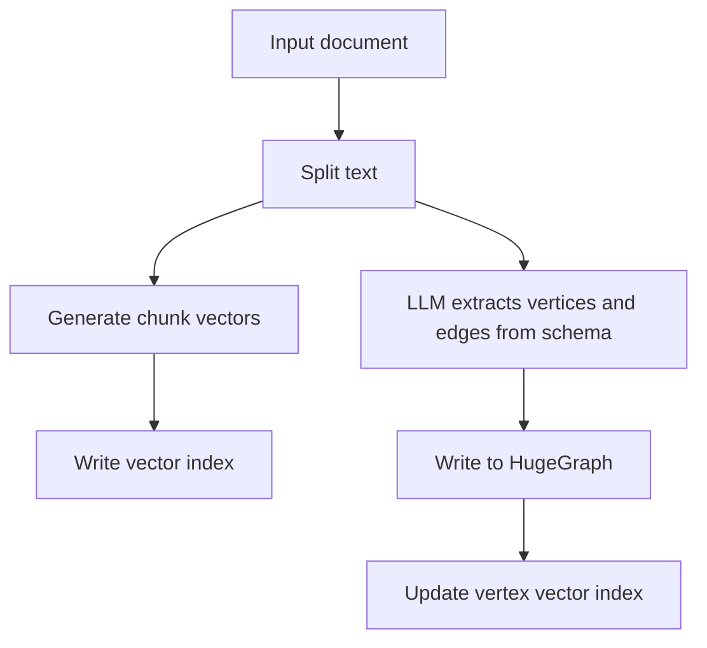
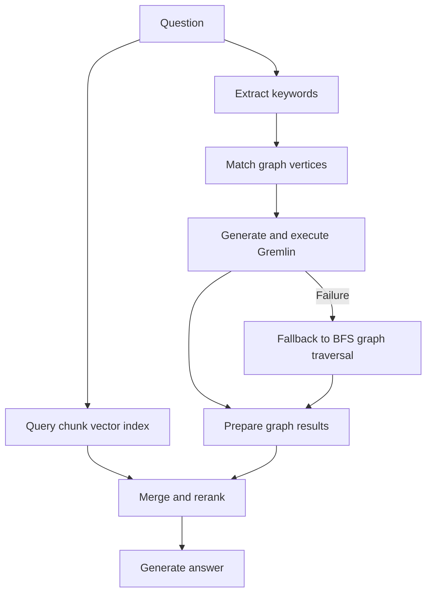

# HugeGraph-LLM Workflow

LLMS index: [llms.txt](/llms.txt)

---

This page explains the processing flow in the HugeGraph-LLM Web UI. See [HugeGraph-LLM](./hugegraph-llm.md) for startup instructions.

## 1. Build RAG Indexes

The first tab splits documents into a chunk vector index. It also extracts vertices and edges according to a schema, writes them to HugeGraph, and maintains a vertex vector index.

Common operations are `Import into Vector`, `Extract Graph Data`, `Load into GraphDB`, and `Update Vid Embedding`. The page can also inspect or clear chunk indexes, vertex indexes, and graph data. Clearing removes existing data, so first confirm that the current graph and indexes are not still used by other queries.

## 2. GraphRAG Queries

The second tab can answer directly with the LLM, use only chunk-vector retrieval, use only graph retrieval, or combine graph and vector retrieval.

Graph retrieval first matches HugeGraph vertices exactly by keyword and then uses vector similarity if no exact match exists. The matched vertices are passed to Text2Gremlin. If generation or execution fails, the pipeline can fall back to a predefined traversal.

`Template Num` controls how many examples Text2Gremlin uses. A value less than or equal to zero supplies no templates; a positive value retrieves that many similar examples.

## 3. Text2Gremlin

The third tab reads the graph schema, retrieves similar natural-language and Gremlin examples, fills the prompt with the question, schema, examples, and matched vertices, then generates Gremlin and optionally executes it.

A custom prompt must contain `{query}`, `{schema}`, `{example}`, and `{vertices}`. The REST API rejects a request if any placeholder is missing.

## 4. Graph and Administration Tools

`Graph Tools` runs graph operations directly. `Admin Tools` provides functions such as log access. When login is enabled, the UI and APIs require `USER_TOKEN`; the log endpoint additionally requires a separately configured, secure `ADMIN_TOKEN`.

## 5. Prompt Language

Set `LANGUAGE=EN` or `LANGUAGE=CN` in `hugegraph-llm/.env`, then restart the service. This selects the language of built-in prompts; it does not translate input documents and is not a field in the `/rag` request body.

## 6. REST Calls

The Web UI and REST API use the same pipeline. For application integration, use `/rag`, `/rag/graph`, `/graph/extract`, and `/text2gremlin`; see the [REST API](./rest-api.md) for request formats.
